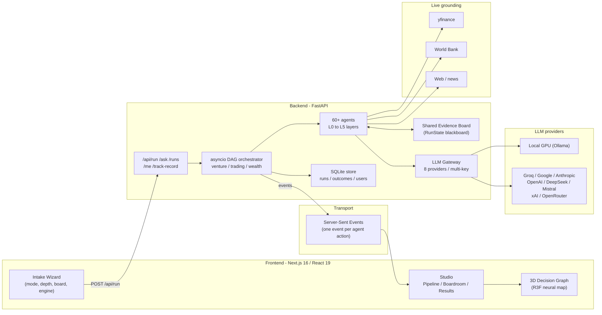
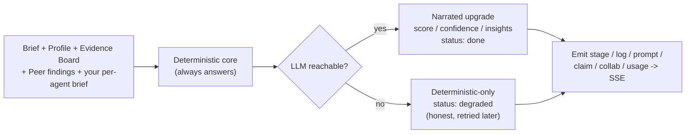
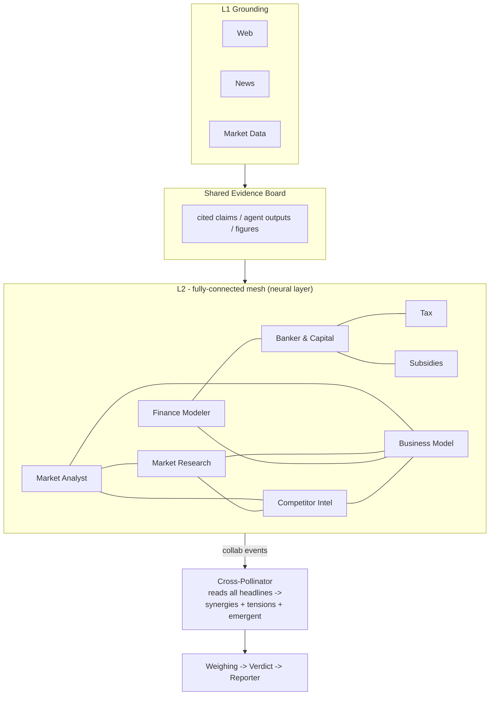
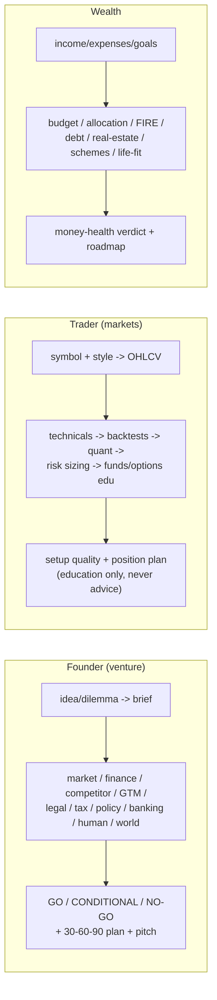
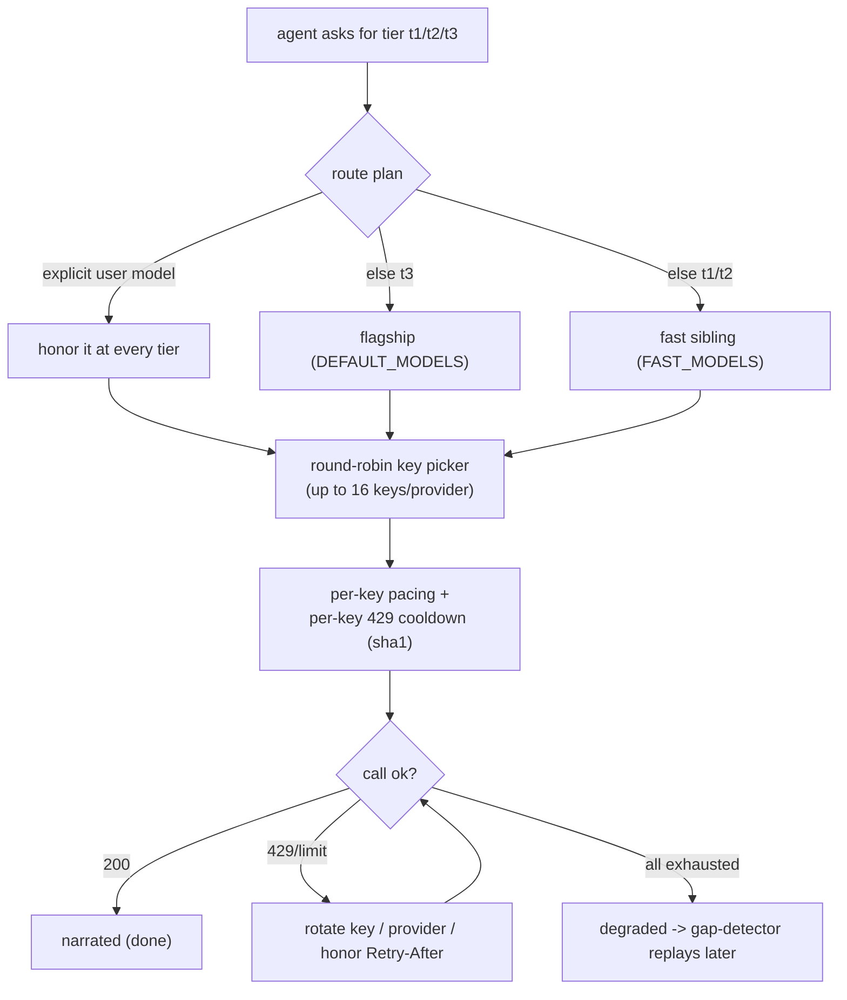
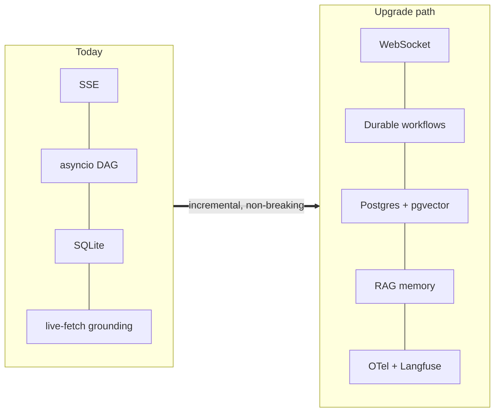
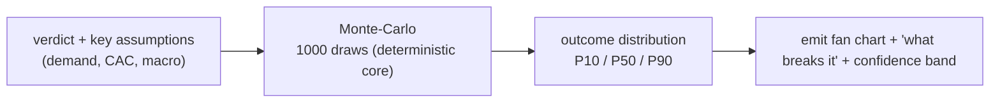

# EIP — The Entrepreneurship / Money Intelligence OS

> **Tell it your situation — a startup idea, a stock, a salary — and a transparent board of 60+ specialist AI agents researches it with live data, argues about it in the open, audits your biases, cross-examines each other, and hands you a weighted, sourced, honest decision. You watch every step.**

<div align="center">

**🌐 Live app:** [eip-cbkt.vercel.app](https://eip-cbkt.vercel.app)  ·  **⚙️ Backend (HF Space):** `Srujan29/eip-backend`

`Next.js 16` · `React 19` · `FastAPI` · `asyncio DAG` · `SSE streaming` · `8 LLM providers` · `zero-key demo mode`

</div>

| Mode | The question it answers | Core specialists |
|---|---|---|
| 🚀 **Founder** | *"Should I build this? How? What will kill it?"* | market, finance, competitors, GTM, legal, tax, policy, banking, human, world |
| 📈 **Trader** | *"Is this a good setup? When? At what risk?"* — analytics + education, **never advice, never execution** | technicals, quant, backtests, risk, options-edu, funds, microstructure |
| 💰 **Wealth** | *"What do I do with the money I have?"* | budget, allocation, FIRE, debt, real-estate, schemes, life-fit |

---

> 📖 **Deep dive:** the full ~50-page engineering document — every file, every function, every agent's prompt/logic/wiring, all permutations, testing guide — lives at [docs/PROJECT_DOCUMENTATION.md](docs/PROJECT_DOCUMENTATION.md).

## Table of contents

1. [What makes it different](#-what-makes-it-different)
2. [System architecture](#-system-architecture)
3. [Tech stack & why each piece](#-tech-stack--why-each-piece-was-chosen)
4. [The pipeline — how a decision is made](#-the-pipeline--how-a-decision-is-made)
5. [The agent roster (60+)](#-the-agent-roster)
6. [Agent-to-agent wiring (the mesh)](#-agent-to-agent-wiring-the-mesh)
7. [The three modes in depth](#-the-three-modes-in-depth)
8. [Board picker & depths](#-board-picker--depths)
9. [The LLM gateway](#-the-llm-gateway-hybrid--multi-provider--multi-key)
10. [Inputs you can give](#-inputs-you-can-give)
11. [Results you get](#-results-you-get)
12. [What it solves / what it cannot do](#-what-it-solves--what-it-cannot-do)
13. [Accuracy & the honesty model](#-accuracy--the-honesty-model)
14. [Frontend architecture](#-frontend-architecture)
15. [Backend architecture — file by file](#-backend-architecture--file-by-file)
16. [Testing guide + test cases](#-testing-guide--test-cases)
17. [Run it locally](#-run-it-locally)
18. [Deployment](#-deployment)
19. [Future improvements](#-future-improvements)
20. [Roadmap / phase status](#-roadmap--phase-status)
21. [Disclaimer](#-disclaimer)

---

## ✨ What makes it different

- **No naked numbers.** Every figure carries a live source or an explicit `ESTIMATE` flag. If no model answered an agent, it says so (amber `degraded` status) instead of faking a green tick.
- **Glass box.** You watch all agents fire — their exact prompts, logs, confidence, token usage, and arguments — streamed live over SSE.
- **The Crucible.** A built-in Red Team, Devil's Advocate, and Bias Auditor attack every thesis — *including your own framing*.
- **A real board, not a chatbot.** Specialists read each other's findings off a shared evidence board, build on colleagues, and cross-examine — a fully-connected neural mesh within each layer.
- **Deterministic cores.** Runway math, technical indicators, backtests, savings math, and the weighing engine are **pure Python** — they can't hallucinate, and they answer even with zero LLM.
- **Runs anywhere.** Your GPU (Ollama, private + free), bring-your-own-key for any of 8 providers, hybrid, or **zero-key demo mode**.

---

## 🏗 System architecture



**Design principle:** the SSE stream *is* the product. A storage or LLM failure must never brick a live run — every layer is fail-soft, and the deterministic cores always produce an answer.

---

## 🧰 Tech stack & why each piece was chosen

| Layer | Choice | Why this and not the alternative |
|---|---|---|
| **Frontend framework** | Next.js 16 (App Router, Turbopack) + React 19 | Streaming-first, RSC-ready, instant HMR; Vercel-native deploy. |
| **Styling** | Tailwind CSS v4 | Zero-runtime, token-driven theming; fast to iterate a dense dashboard. |
| **State** | Zustand | One tiny store fed one SSE event at a time — no boilerplate. |
| **3D** | React-Three-Fiber + drei + three | The neural map needs a real force-directed 3D graph; R3F keeps it declarative. |
| **Charts** | Hand-rolled zero-dep SVG (`chart-kit.tsx`) | 11 chart types + what-if sliders with **no chart library** → tiny bundle, full control. |
| **API framework** | FastAPI | First-class async + `StreamingResponse` for SSE; Pydantic validation. |
| **Orchestration** | Plain `asyncio` DAG (not LangGraph) | We need fine-grained fan-out/fan-in, two-wave A2A ordering, and per-agent cancellation — a hand-written DAG is simpler and faster here. |
| **Serialization** | orjson | Fastest JSON for the SSE hot path and blob storage. |
| **Live market data** | yfinance | Free, no key, global coverage (NSE/BSE/US/indices). |
| **Macro data** | World Bank API | Free, official GDP/inflation/rates series. |
| **Persistence** | SQLite (Postgres-ready via `DATABASE_URL`) | Zero-infra, fail-soft; history is a convenience, not a dependency. |
| **LLM access** | Custom gateway over 8 providers | Free-tier survival: round-robin multi-key rotation, per-key pacing, 429 cooldowns, tier-split routing, graceful degrade. |
| **Local inference** | Ollama | Private, free, runs on a 6 GB laptop GPU. |
| **Deploy** | Vercel (frontend) + HF Spaces Docker (backend) | Both have generous free tiers; matches "accessible to as many people as possible". |

---

## 🔬 The pipeline — how a decision is made

Every mode runs the same six intelligence layers (`L0 → L5`), fanning out and back in:

```mermaid
flowchart TD
    L0["L0 - Gateway<br/>Intake Parser -> Context Profiler -> Scope Planner<br/>(sequential: your words -> brief + convened board)"]
    L1["L1 - Grounding (parallel)<br/>Web / News / Market Data / Macro Data / Doc Analyst<br/>(live evidence onto the shared board)"]
    L2a["L2 - Domain wave 1 (foundational, parallel)<br/>Market / Market Research / Finance / Competitor / Industry /<br/>Consumer / Human / Tax / Legal / Policy / Macro"]
    L2b["L2 - Domain wave 2 (integrative, parallel)<br/>Business Model / Banking / GTM / Marketing / Regulator / World<br/>(read wave-1 findings -> build on / reconcile / push back)"]
    L3["L3 - The Crucible (parallel)<br/>Red Team / Devil's Advocate / Bias Auditor / Fact Checker"]
    L35["L3.5 - War Room only<br/>open debate rounds (attack -> rebuttal -> concession)"]
    REPLAY["Gap-detector replay<br/>(retry degraded agents after quota refresh)"]
    L4["L4 - Synthesis<br/>Cross-Pollinator -> Compliance Sentinel -> Connecting Dots -><br/>Weighing -> Verdict -> Storyteller -> Visualizer -> Reporter"]
    L5["L5 - Memory<br/>run saved -> Decision Graph + history + outcome tracking"]

    R2["ROUND 2 - golden-arc deliberation (Board/War Room)<br/>EVERY specialist re-reads the FULL board and refines -<br/>the first agent now sees everyone, exactly like the last"]

    L0 --> L1 --> L2a --> L2b --> R2 --> L3 --> L35 --> REPLAY --> L4 --> L5
```



**Every agent's contract** (the invariant that makes the glass box trustworthy):



---

## 🤖 The agent roster

**63 agents defined · 60 implemented**, across six intelligence layers. Tier legend: `t0` = deterministic (no LLM), `t1/t2` = fast tier, `t3` = flagship tier.

### L0 · Gateway (3)
| Agent | Tier | Capability |
|---|---|---|
| Intake Parser | t1 | Turns free text into a structured brief (industry, geo, stage, keywords). |
| Context Profiler | t1 | Infers who's asking — capital band, risk capacity, stage. |
| Scope Planner | t1 | Chooses which specialists to convene for the chosen depth + your toggles. |

### L1 · Grounding (5)
| Agent | Tier | Capability |
|---|---|---|
| Web Researcher | t2 | Live web evidence — competitors, market size, claims. |
| News Intelligence | t2 | What's happening right now in the space. |
| Market Data | t0 | Live prices, indices, OHLCV (yfinance). |
| Macro Data | t0 | GDP, inflation, rates (World Bank). |
| Document Analyst | t2 | Reads your uploaded pitch deck / P&L / contract → cited chunks onto the board. |

### L2 · Venture (16)
Market Analyst · **Market Research** (TAM/SAM/SOM) · Finance Modeler · **Banker & Capital** (loans, Mudra/CGTMSE/PMEGP, capital stack) · Competitor Intelligence · Business Model · GTM & Distribution · Marketing Strategist · Legal · Tax (India-first) · Policy & Compliance · Regulator Analysis · Subsidies & Schemes · Industry Expert · HR & Talent · Optimization Predictor.

### L2 · Markets (8) — the Trading Co-Pilot
Technical Analyst `t0` · Quant Signals `t0` · Backtest Engineer `t0` · Risk Manager `t0` · Stock Analyst · Options & Derivatives (education) · Fund Analyst · HFT / Microstructure (education).

### L2 · Wealth (6)
Salary & Budget · Portfolio Allocator `t0` · FIRE / Goal Planner `t0` · Debt & Banking · Real Estate · Location Opportunity Scout.

### L2 · World (5)
Macroeconomist · Geopolitics · International Markets · Trends & Weak Signals · ESG & Impact.

### L2 · Human layer (7)
Human Behaviour · Human Needs (Maslow) · Consumer Analysis · Production & Ops · Philosophy & Ethics `t3` · Money & Happiness · Philanthropy & Impact.

### L3 · The Crucible (4)
Red Team `t3` · Devil's Advocate `t3` · Bias Auditor `t3` · Fact Checker.

### L4 · Synthesis (8)
Connecting Dots `t3` · **Cross-Pollinator** `t3` (every specialist read against every other → synergies & tensions) · **Compliance Sentinel** `t0` (deterministic regulatory red-flag scan) · Storyteller `t3` (the pitch) · Weighing Engine `t0` (deterministic scoring) · Verdict Composer `t3` · Visualizer `t2` · Reporter `t3`.

### L5 · Memory (1)
Decision Graph `t0` — every run becomes memory + a 3D knowledge graph.

---

## 🕸 Agent-to-agent wiring (the mesh)

The substrate is a **shared evidence board** (`RunState.evidence` + `RunState.outputs`) that every agent reads and writes. On top of it, three mechanisms make the board a genuine collaboration, not 60 solo calls:

1. **Curated peer-injection** (`venture.PEERS`) — each specialist is handed the headline findings of the colleagues it should build on, with the instruction *"build on, reconcile, or push back — don't just repeat."*
2. **Two-wave L2** — foundational analysts run first; integrative agents run second and read the first wave.
3. **Two-round deliberation** (`deliberate.py`, Board/War Room) — round 1 is independent analysis; in **round 2 every specialist re-runs with the FULL board's round-1 findings in its prompt**. This fixes the ordering unfairness: the *first* agent now reads everyone, exactly like the last. The round-1 snapshot is kept, so results show who revised, who converged, who dug in.
4. **The Cross-Pollinator** (L4) — a final synthesis pass that reads *every* specialist's headline against *every* other, emits a `collab` event from each to all peers (lighting the full intra-layer mesh live), and surfaces labeled **synergies** and **tensions**.



The frontend visualizes this in two places: the **Flow Map** draws the complete intra-layer graph (gold arcs, bright when a pair actually communicated this run), and the **3D Decision Graph** wires agents to the colleagues they built on.

---

## 🎛 The three modes in depth



| | 🚀 Founder | 📈 Trader | 💰 Wealth |
|---|---|---|---|
| **Grounds on** | web + news + macro + your docs | live OHLCV + news + macro | macro + your numbers |
| **Deterministic core** | runway / unit economics | 40+ indicators, backtests, risk sizing | savings, allocation, FIRE math |
| **Radar dimensions** | Market · Economics · Execution · Evidence · Timing · Regulatory · HumanFit | Trend · Momentum · Value · History · RiskFit · Psychology | Cashflow · Allocation · GoalFit · DebtHealth · Opportunity · LifeFit |
| **Verdict** | GO / CONDITIONAL_GO / NO_GO | setup quality band | money-health band |
| **Hard stance** | education + analytics | **never buy/sell advice, never executes** | education, not regulated advice |

---

## 🎚 Board picker & depths

You choose *how deep* the board goes; the Scope Planner convenes accordingly. You can also hand-pick individual agents and give any of them a **personal brief** it reads verbatim.

| Depth | Founder | Trader | Wealth | What you get |
|---|---|---|---|---|
| **Pulse** | ~13 | core desk | money core | Fast read — the spine + core analysts. |
| **Board Meeting** | ~26 | + world & human lenses | + world & human lenses | The full board incl. Market Research, Banking, human layer. |
| **War Room** | ~37 | + full world cluster | + full world cluster | Everything + **live debate rounds** (attack → rebuttal → concession). |

The **synthesis layer is never optional** — someone always has to sign the verdict, cross-pollinate, scan compliance, and write the report.

---

## 🔌 The LLM gateway (hybrid · multi-provider · multi-key)



- **8 providers**: Groq · Google · Anthropic · OpenAI · DeepSeek · Mistral · xAI · OpenRouter (+ local Ollama).
- **Multi-key rotation** — up to **16 keys per provider**, round-robin from call #1 for N× throughput on free tiers (sized so a full War Room + two deliberation rounds + the Reporter never starve).
- **Tier-split** — `t3` uses flagship models (e.g. `llama-3.3-70b`, `claude-sonnet-4-5`); `t1/t2` use fast siblings; an explicit user choice wins at every tier.
- **Degraded honesty** — if no key answers, the agent ships its deterministic core with an amber `degraded` status; the **gap-detector** retries it after the per-minute quota refreshes.
- **BYOK & privacy** — keys are per-run, never stored server-side; local-GPU mode hides the cloud grid entirely.

---

## ⌨️ Inputs you can give

**Founder** — situation (free text), industry, geography, stage, budget band, team size, biggest uncertainty, target customer, competitors, revenue model, **+ upload** pitch deck / P&L / contract (PDF/TXT).

**Trader** — symbol (e.g. `RELIANCE.NS`, `AAPL`, `^NSEI`), trading style (intraday / swing / position / options-edu), capital, risk % per trade, existing position, your thesis.

**Wealth** — monthly income & expenses, current savings, age, risk appetite, city, goals, dependents, current debt, monthly SIP.

**Every mode also takes** — depth, hand-picked board, per-agent briefs, engine config (provider/keys/model, temperature, max-tokens, per-agent routing).

---

## 📊 Results you get

- **Weighted verdict** — score /10, band, reasoning, sensitivities ("what would change this").
- **Compliance Sentinel banner** — ranked regulatory red-flags, high-severity elevated.
- **Dimension radar** + exact per-dimension scores.
- **Risk register & opportunities** with the sourcing agent named.
- **The pitch** (Storyteller) — hook, ~120-word narrative, one-liner, three beats.
- **Cross-pollination** — synergies & tensions between specialists + emergent board-level insights.
- **Two-round deliberation** — round-1 vs round-2 comparison: which specialists revised their score after reading the full board (+ a "board after deliberation" chart).
- **Interactive chart gallery** (Visualizer) — gauge, waterfall, bar/column, donut, scatter, heatmap, candlestick, area, bullet — each with a **what-if slider**.
- **Per-agent cards** — every specialist's finding, score, confidence, sources, and its own what-if.
- **The full written report** (Reporter) — a sectioned decision document.
- **3D Decision Graph** — the whole run as a living neural map.
- **Ask the Board** — grounded follow-up chat.
- **Export** — Markdown / JSON / PDF.
- **Outcome tracking** — record what you did + how it went; the board grades its own calibration.

---

## ✅ What it solves / ❌ what it cannot do

**Solves** — structured go/no-go analysis for a venture; multi-lens stress-testing of a plan; setup-quality read on a stock with real indicators + backtests + risk sizing; money-health check with budget/allocation/FIRE math; surfacing regulatory red-flags, subsidies, and biases; turning analysis into a pitch; keeping a decision journal that measures its own accuracy.

**Cannot do (by design or limitation)** — it is **not** financial/legal/tax advice and **does not execute trades**; it cannot see private/paywalled data beyond what you upload; LLM narrative can still be wrong (hence sources + `ESTIMATE` flags + the Crucible); free-tier keys can rate-limit (mitigated by rotation + replay, but a fully-starved run degrades to deterministic cores); no true vector-RAG yet (grounding is live-retrieval + blackboard — see [Future improvements](#-future-improvements)); OCR of scanned images is deferred (heavy vision deps don't fit the free CPU tier).

---

## 🎯 Accuracy & the honesty model

Accuracy is **not** claimed as a single number — it's engineered as *calibrated honesty*:

- **Deterministic cores** (runway, indicators, backtests, savings, weighing) are exact math — 100% reproducible, never hallucinated.
- **LLM narrative** is bounded by sourced evidence; unsourced figures must be tagged `ESTIMATE`; the Fact Checker lowers the Evidence dimension when claims don't trace to the board.
- **The Crucible** actively hunts for the failure case, so the verdict isn't a hype machine.
- **Confidence is surfaced per claim**, disagreement is preserved (never averaged away), and `degraded` agents are shown honestly.
- **Outcome tracking** turns accuracy into a measurable, self-reported track record over time (GO hit-rate).

---

## 🎨 Frontend architecture

```
frontend/
├─ app/
│  ├─ page.tsx           landing (hero, live agent counts)
│  ├─ studio/page.tsx    the studio shell
│  ├─ history/page.tsx   past decisions + outcome tracking + track record
│  ├─ graph/page.tsx     standalone 3D decision graph for a saved run
│  └─ layout.tsx         root layout, fonts, aurora/grain texture
├─ components/
│  ├─ studio/
│  │  ├─ intake-wizard.tsx   4-step wizard (situation -> depth -> board -> engine)
│  │  ├─ board-picker.tsx    org-chart board picker, per-agent briefs, depth scopes
│  │  ├─ engine-panel.tsx    8 providers, key slots, sliders, per-agent routing
│  │  ├─ studio-client.tsx   run driver: Pipeline / Boardroom / Results tabs
│  │  ├─ flow-map.tsx        live pipeline flow + the gold A2A mesh
│  │  ├─ pipeline-rail.tsx   layer-grouped agent status rail
│  │  ├─ stage-cards.tsx     per-agent cards with exact-prompt reveal
│  │  ├─ boardroom.tsx       claims / conflicts / bias / debate feed
│  │  ├─ decision-room.tsx   the Results view (verdict, compliance, story, cross-links)
│  │  ├─ results-v4.tsx      KPI tiles, key findings, agent table, domain screens
│  │  ├─ insights.tsx        chart gallery, smart insights, report section
│  │  ├─ chart-kit.tsx       11 zero-dep SVG chart types + what-if sliders
│  │  ├─ sim-charts.tsx      runway / market / score simulators
│  │  ├─ agent-sim.tsx       per-agent what-if
│  │  ├─ radar.tsx           interactive dimension radar
│  │  ├─ disagreements.tsx   where the board split
│  │  ├─ trade-desk.tsx      trader-specific position card
│  │  └─ ask-board.tsx       grounded follow-up chat
│  └─ graph/neural-map.tsx   R3F 3D force graph
└─ lib/
   ├─ agents.ts       client mirror of the registry (ids, layers, icons, PEERS, capsFor)
   ├─ store.ts        zustand run store — one SSE event at a time
   ├─ api.ts          SSE consumer + REST client (runs, outcomes, me, track-record)
   ├─ types.ts        the SSE contract (event shapes) + result types
   ├─ graph-data.ts   run -> 3D node/edge cloud (incl. A2A edges)
   ├─ dimensions.ts   agent -> radar dimension map (drives what-if)
   ├─ export.ts       Markdown / JSON / PDF export
   └─ user.ts         anonymous-first identity + tier headers
```

---

## 🐍 Backend architecture — file by file

```
backend/app/
├─ main.py                 FastAPI app + CORS + router mount
├─ api/runs.py             /api/run (SSE) /ask /runs /me /track-record /extract
├─ core/
│  ├─ config.py            DEFAULT_MODELS + FAST_MODELS per provider, tiers
│  ├─ events.py            Emitter (SSE) + StageStatus + every event type (incl. collab)
│  └─ llm_gateway.py       hybrid gateway: routing, multi-key rotation, cooldowns, degrade
├─ agents/
│  ├─ base.py              RunState (the blackboard) + Ctx (agent execution context)
│  ├─ registry.py          the full roster (id, name, layer, cluster, tier, implemented)
│  ├─ catalog.py           mode-agnostic LENS_AGENTS + depth scopes + L2_FOUNDATIONAL
│  ├─ venture.py           venture agents + _scored_analysis + PEERS + weighing/verdict
│  ├─ board.py             board wave + crucible + cross_pollinate + compliance_scan + storytelling
│  ├─ markets.py           trader desk (history->technical->backtest->quant->risk)
│  ├─ wealth.py            money math (budget, allocation, FIRE, debt, real-estate)
│  ├─ human.py             the 7 human-layer lenses
│  ├─ studio.py            Visualizer (chart specs) + Reporter (retry ladder)
│  └─ replay.py            gap-detector — re-runs degraded agents after cooldown
├─ graphs/
│  ├─ venture.py           founder pipeline (two-wave L2, cross-pollinate, synthesis)
│  ├─ trading.py           trader pipeline
│  └─ wealth.py            wealth pipeline
├─ grounding/
│  ├─ market.py            yfinance connector (prices, OHLCV, sector proxy)
│  ├─ macro.py             World Bank connector
│  └─ web.py               web/news search
├─ engine/
│  ├─ indicators.py        40+ technical indicators (pure pandas)
│  └─ backtest.py          strategy backtester vs buy-and-hold
└─ memory/store.py         SQLite: runs / outcomes / users-tiers / calibration
```

**Key functions worth knowing:**
- `agents/venture.py :: _scored_analysis(...)` — the universal analyst wrapper: injects peer findings + research + evidence, calls the LLM, falls back to the deterministic core, emits `collab`.
- `agents/board.py :: cross_pollinate(...)` — the all-to-all second synthesis pass.
- `agents/board.py :: compliance_scan(...)` — deterministic regulatory red-flag scan.
- `agents/studio.py :: reporter(...)` — the report writer with an escalating retry ladder (runs last & alone so the biggest call gets the whole key pool).
- `core/llm_gateway.py :: complete(...)` — tier routing + multi-key rotation + degrade.
- `memory/store.py :: track_record()` — the platform's own calibration scorecard.

---

## 🧪 Testing guide + test cases

### How to test (fastest path)
1. Open the [live app](https://eip-cbkt.vercel.app) → **Studio**.
2. Pick a mode, fill the intake, choose **Board Meeting** depth.
3. Engine: **Demo** (zero keys — deterministic cores, proves the pipeline) *or* **My API keys** (paste a Groq key for full narration).
4. Watch the **Pipeline** tab (gold A2A mesh lights up), then read **Results**.

### Test cases & expected results

| # | Mode | Input | Expected |
|---|---|---|---|
| 1 | Founder | *"D2C millet snack brand in Bangalore, subscription-first, health-conscious professionals; savings, no co-founder"* · Board · Demo | Full board runs; radar with Market/Economics/…/HumanFit; compliance banner (FSSAI); cross-pollination synergies/tensions; verdict band; report. Narrative agents show `degraded` in Demo (expected). |
| 2 | Founder | Same, engine = **Groq key**, War Room | All agents narrated (`done`); debate rounds in Boardroom; Storyteller pitch; 20+ live gold A2A arcs. |
| 3 | Trader | `RELIANCE.NS` · swing · capital ₹1,00,000 · risk 1% | Real OHLCV candlestick; indicator reads; backtest table vs buy-and-hold; risk sizing (position + stop + max loss); **setup-quality** verdict, never "buy". |
| 4 | Trader | `AAPL` · position | Resolves US symbol; fund/options-education cards; microstructure reality check. |
| 5 | Wealth | income ₹1,20,000 · expenses ₹70,000 · savings ₹5,00,000 · age 30 · FIRE by 45 · Bengaluru | Savings-rate donut; FIRE-number area chart with what-if; allocation glide-path; debt order; life-fit dimension. |
| 6 | Any | Record an outcome on **/history** | GO hit-rate + status counts update in the track-record header. |
| 7 | Reliability | 42-agent run on one starved free key | Gap-detector replays degraded agents; Reporter self-heals via its retry ladder; honest amber status where truly unreachable. |

### Local verification the repo ships
- Backend import smoke test + in-process E2E (all layers, collab events, `cross_insights` + `compliance_alerts` partials, no exceptions).
- Frontend `tsc --noEmit` + `next build` (all routes prerender clean).

---

## 💻 Run it locally

```bash
# backend  (Python 3.12)
cd backend
python -m venv .venv && .venv\Scripts\activate      # Windows
# source .venv/bin/activate                          # macOS/Linux
pip install -r requirements.txt
# optional: a server-side key so agents narrate out of the box
setx EIP_GROQ_API_KEY "gsk_..."                      # or export ...
python -m uvicorn app.main:app --port 8000

# frontend  (Node 20+)
cd frontend
npm install
echo "NEXT_PUBLIC_API_URL=http://localhost:8000" > .env.local
npm run dev            # http://localhost:3000
```

Zero keys? The app runs in **Demo** mode (deterministic cores). One Groq key unlocks full narration. Add up to 16 keys/provider in the engine panel for free-tier throughput.

**Optional local GPU:** install [Ollama](https://ollama.com), `ollama pull qwen3:4b`, pick **Local GPU** in the engine panel — fully private, zero cloud.

---

## 🚀 Deployment

- **Frontend → Vercel.** Production branch = `main`. Every release fast-forwards `main` so the production deploy tracks it.
- **Backend → Hugging Face Spaces (Docker).** Pushed via `git subtree split --prefix backend`. Set the `EIP_GROQ_API_KEY` (or other provider) Space secret.
- **Persistence:** set `EIP_DB_PATH` to a mounted persistent volume so run history survives restarts. `DATABASE_URL` (Postgres) is the managed-DB upgrade path.

> Each release = 3 pushes: `origin HEAD` (working branch) · `origin HEAD:main` (Vercel prod) · `space` subtree (HF backend).

---

## 🔮 Future improvements

### Better tech stacks that would level up the app

| Area | Today | Upgrade | Payoff |
|---|---|---|---|
| **Retrieval** | live-fetch + blackboard, naive doc chunking | **True RAG** — embed docs + past runs, semantic retrieval (pgvector / Qdrant / LanceDB + a cloud embeddings endpoint) | Each agent pulls the *most relevant* passage, not the first N; institutional memory across runs. |
| **Orchestration** | hand-written asyncio DAG | Temporal / durable execution or LangGraph checkpointing | Pause/resume long War-Room runs, retries as first-class, replay from any step. |
| **Streaming** | SSE | WebSocket / tRPC subscriptions | Bi-directional (interrupt an agent, steer a debate live). |
| **Data** | SQLite | Postgres + pgvector (Neon/Supabase) | Multi-user at scale, vector memory, real auth. |
| **Local inference** | Ollama single model | vLLM / TGI + a 7–14B tuned model | Faster, cheaper, private full-board runs. |
| **Market data** | yfinance | a real data vendor (Polygon / Kite / Alpha Vantage) | Intraday depth, corporate actions, options chains. |
| **Observability** | logs + SSE | OpenTelemetry + Langfuse traces | Per-agent latency/cost dashboards, prompt A/B. |
| **Auth/billing** | anonymous id + tiers scaffold | Clerk/Auth.js + Stripe | Real accounts, Pro quota, saved boards. |



### Existing agents — capabilities that would sharpen them
- **Fact Checker → live cross-checker**: verify each numeric claim against a fresh targeted search, not just the board.
- **Backtest Engineer → walk-forward + Monte-Carlo**: out-of-sample robustness, not a single in-sample pass.
- **Risk Manager → portfolio-level**: correlation, VaR, position interaction (not per-trade only).
- **Competitor Intel → funding-graph**: pull live funding/hiring signals into a positioning map.
- **Reporter → templated exports**: investor-memo / one-pager / board-deck formats.
- **Weighing Engine → learned weights**: calibrate dimension weights from the outcome-tracking data.

### New agents worth adding
| Proposed agent | Layer | Skill / logic it adds |
|---|---|---|
| **Scenario Planner** | L4 | Monte-Carlo the verdict across best/base/worst macro + demand assumptions. |
| **Pricing Strategist** | L2 venture | Van-Westendorp / value-based pricing, willingness-to-pay curves. |
| **Supply-Chain Analyst** | L2 venture | Input dependency, single-source fragility, logistics cost. |
| **Cohort / Retention Analyst** | L2 human | Retention curves, LTV by cohort, churn drivers. |
| **Cap-Table / Dilution Modeler** | L2 venture | Round math, ESOP, dilution across scenarios. |
| **Sentiment Analyst** | L1 grounding | Social/review sentiment as a live demand signal. |
| **Patent / IP Scout** | L2 venture | Prior-art & freedom-to-operate signals. |
| **Insurance & Risk-Transfer** | L2 venture | What's insurable, what liability to transfer. |
| **Sustainability Accountant** | L2 world | Carbon/impact quantified into cost & moat. |
| **Negotiation Coach** | L4 | Turn the plan into BATNA/anchors for the next conversation. |

### Per-new-agent shape (example: Scenario Planner)


---

## 🗺 Roadmap / phase status

- ✅ **Phase 0–7** — three modes, full roster, studio, board picker, results, 3D graph, human layer.
- ✅ **Phase 8** — Market Research + Banker + Storyteller agents; full A2A mesh; Reporter self-heal.
- ✅ **Phase 9** — gap-detector replay; PDF export; **outcome tracking + calibration**; **Compliance Sentinel**.
- ✅ **Phase 9.5** — **Cross-Pollinator** (all-to-all second synthesis pass, live mesh).
- ✅ **Phase 10 (scaffold)** — anonymous accounts + **tiers**, per-user history, persistent-DB path (`EIP_DB_PATH`), Postgres-ready.
- ✅ **Phase 11** — **two-round golden-arc deliberation** (all-to-all re-read, round-1 vs round-2 results) + **16 keys/provider** rotation.
- ⏳ **Phase 10 (managed)** — real auth + Stripe + managed Postgres/pgvector (needs a Neon/Supabase + Stripe signup).
- ⏳ **Phase 8.2** — OCR of scanned images (deferred; heavy vision deps vs. free CPU).
- 🔭 **Next** — true RAG memory, scenario planner, learned weights (see [Future improvements](#-future-improvements)).

---

## ⚠️ Disclaimer

EIP provides **analytics and education, not financial, legal, or tax advice**, and it **never executes trades**. Every figure is either live-sourced or flagged `ESTIMATE`. Decisions and outcomes are yours. Verify regulatory and tax specifics against the current official source.

<div align="center">

*Built as a transparent, glass-box alternative to a single-answer chatbot — because the reasoning matters as much as the verdict.*

</div>
