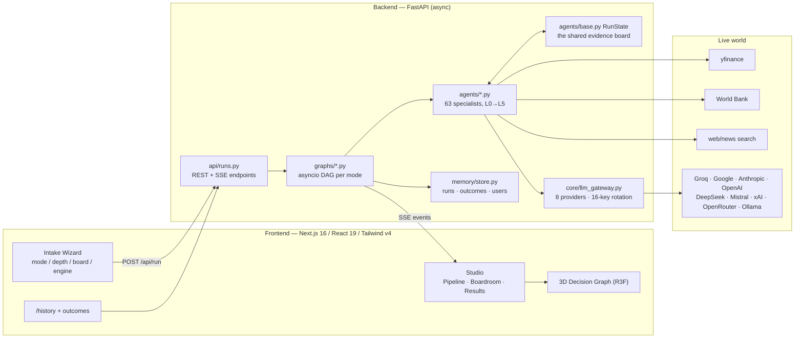
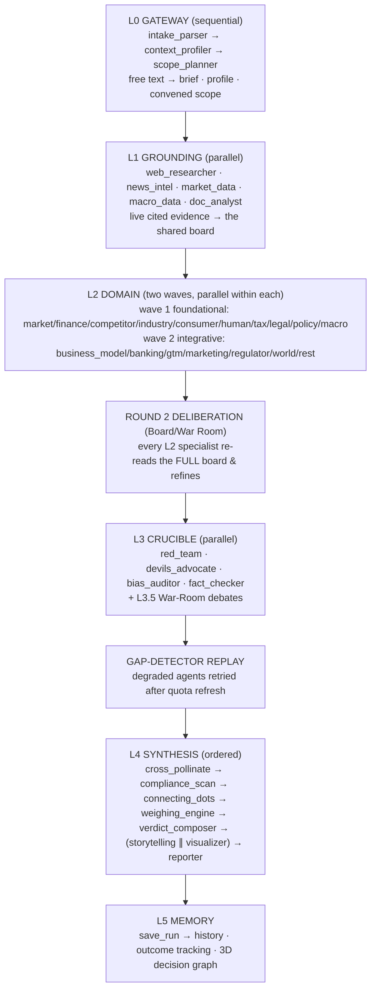
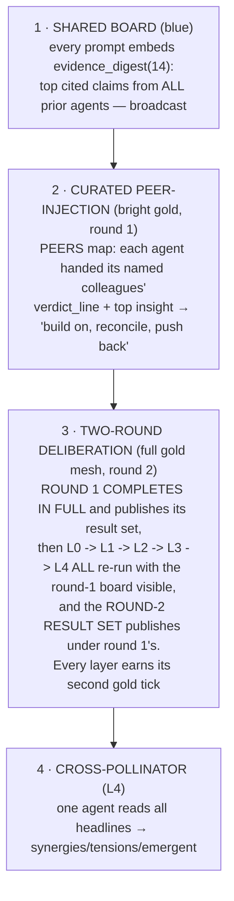
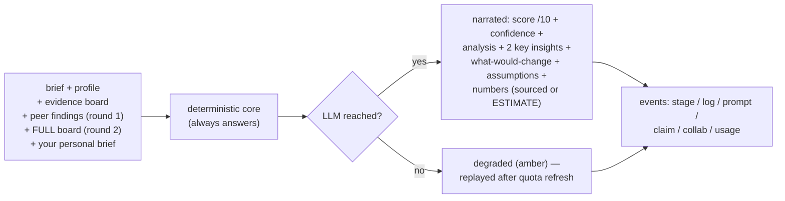
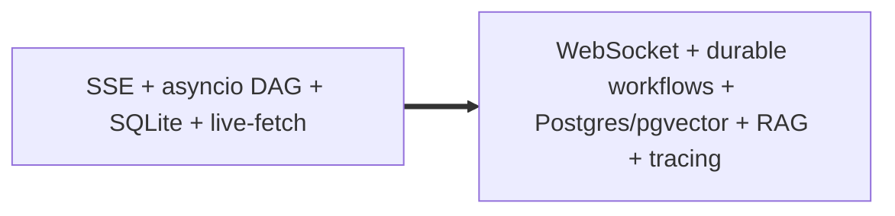
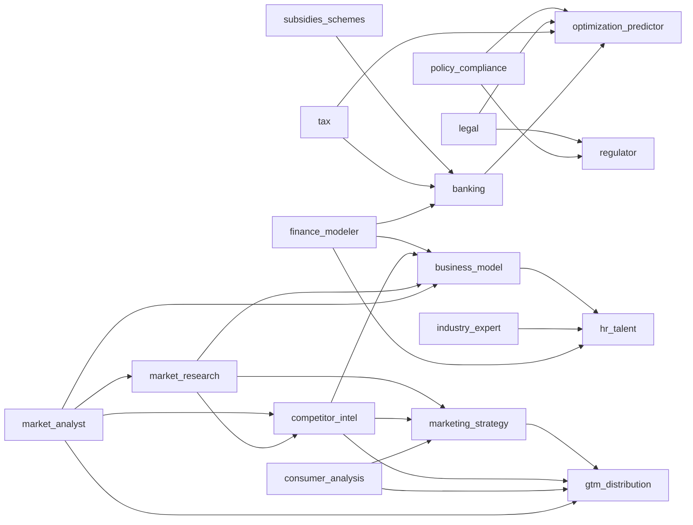
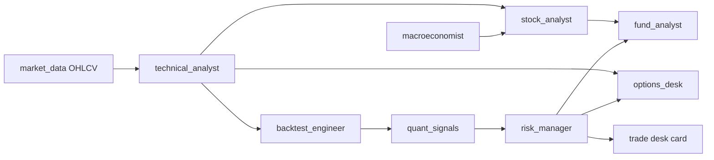
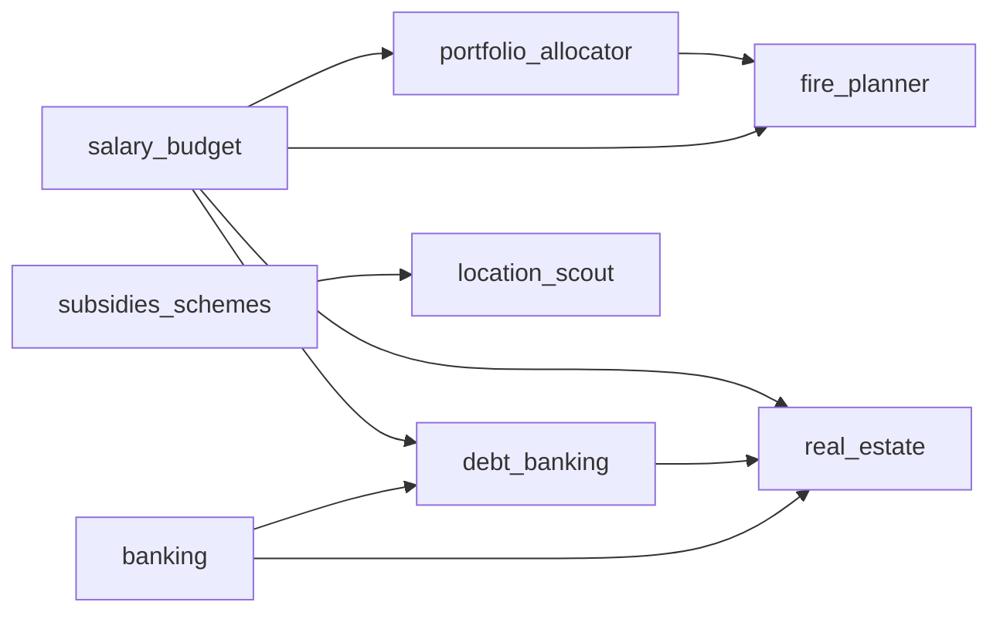
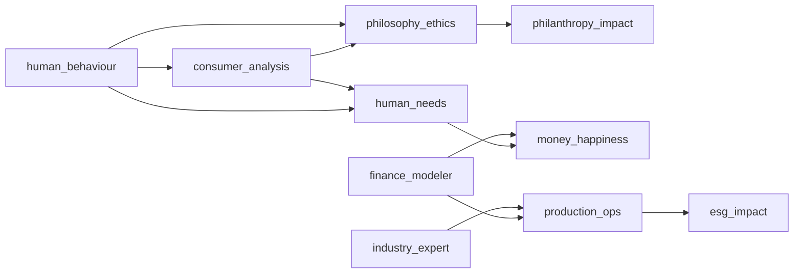
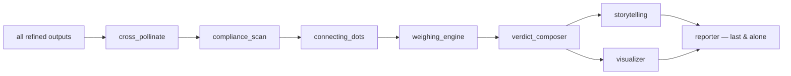

# EIP — Complete Project Documentation

**The Entrepreneurship / Money Intelligence OS — full engineering & product reference**

*Version: Phase 13 (true two-pass pipeline with TWO published result sets + 10 future-improvements agents shipped) · Live at [eip-cbkt.vercel.app](https://eip-cbkt.vercel.app) · Backend Space: `Srujan29/eip-backend`*

> This is the deep companion to the [README](../README.md). It documents **everything**: every code file and its functions, every agent's logic/prompt/wiring, every mode × depth × engine combination, the exact SSE contract, the accuracy model, a complete testing guide, and the future-improvement roadmap — with diagrams throughout. Printed, it runs ~50 pages.

---

## Table of contents

**Part I — Product & Architecture**
1. Executive summary
2. Product vision & the three user journeys
3. System architecture (bird's-eye)
4. Tech stack — what, why, and what was rejected
5. The transport: SSE event contract (every event type)
6. The six intelligence layers, in depth
7. The communication architecture (blue lines, gold lines, two rounds)
8. The LLM gateway — routing, 16-key rotation, degrade, self-heal

**Part II — The Code & The Agents**
9. Backend — file by file, function by function
10. The agent compendium — all 73 agents (logic · prompt · wiring · output)
11. The weighing engines & dimensions (exact scoring logic)
12. Modes × depths — the exact scope matrix

**Part III — Frontend, Usage & Beyond**
13. Frontend — file by file
14. Inputs reference (every field, every mode)
15. Results catalog (every section, every chart, every simulator)
16. Permutations & combinations — what the app can express
17. Accuracy & the honesty model
18. Persistence, accounts, tiers, outcome tracking
19. Deployment & operations
20. Testing guide — manual + scripted + 12 test cases
21. Known limitations
22. Future improvements (tech stacks, sharper agents, new agents)
23. Glossary
24. Appendix A — HTTP API reference
25. Appendix B — event payload shapes

**Part IV — The Agent Prompt Book & Cluster Wiring**
26. Prompt essences — how each specialist is instructed (incl. the round-2 deliberation prompt)
27. Cluster wiring diagrams (venture · markets · wealth · human · synthesis)
28. How each stage behaves per board-picker setting
29. What the app solves / cannot solve (expanded)

---

# Part I — Product & Architecture

## 1. Executive summary

EIP answers three money questions — *should I build this?* (Founder), *is this a good setup?* (Trader), *what do I do with my money?* (Wealth) — by convening a **transparent board of 63 specialist AI agents** organized into six intelligence layers (L0 gateway → L5 memory). The board grounds itself in **live data** (web, news, yfinance prices, World Bank macro, the user's own documents), analyzes through **domain + world + human lenses**, attacks its own thesis in a **crucible** (red team, devil's advocate, bias audit, fact-check), **deliberates in two rounds** so every specialist reads every other, and synthesizes a **weighted, sourced verdict** with charts, what-if simulators, a pitch narrative, compliance red-flags, and a full written report — all streamed live over SSE so the user watches every prompt, log, and argument.

Three properties make it trustworthy rather than impressive-sounding:

1. **Deterministic cores** — the math (runway, indicators, backtests, savings, weighing) is pure Python and always answers, even with zero LLM keys.
2. **Honest degradation** — an agent that no model reached ships its deterministic answer with an amber `degraded` badge, is retried after quota refresh, and is never shown as a green tick.
3. **Sourced-or-flagged numbers** — every figure carries a live source or an explicit `ESTIMATE` tag; a fact-checker lowers the Evidence dimension when claims don't trace.

## 2. Product vision & the three user journeys

**Vision.** A single-answer chatbot hides its reasoning; a consultant is expensive and slow. EIP is the third thing: a *glass-box decision instrument* — the reasoning of a full advisory board, visible and interrogable, at the cost of a few free-tier API keys (or zero, in demo mode).

### Journey A — the Founder
Ramya wants to launch a D2C millet snack brand in Bangalore. She types three sentences, picks **Board Meeting** depth, pastes two Groq keys. Over ~3 minutes she watches: grounding agents pull live market/news/macro; sixteen venture specialists plus world and human lenses analyze; the golden mesh lights as Banking builds on Finance's runway math; round 2 fires and Market Research revises its score after seeing Competitor Intel's density read; the Red Team attacks; the verdict lands at 6.4/10 CONDITIONAL GO with FSSAI licensing flagged by the Compliance Sentinel, a Mudra-loan capital plan, a pitch narrative, 14 interactive charts, and a 900-word report. She records the outcome three months later; the platform's GO hit-rate updates.

### Journey B — the Trader
Arun types `RELIANCE.NS`, swing style, ₹2L capital, 1% risk. The deterministic chain runs: 2 years of OHLCV → 40+ indicators → strategies proven on history → quant ensemble vote → position sizing with stop and max loss. LLM narrative layers the story on top; options/fund/microstructure agents teach; the verdict is **setup quality, never "buy"**.

### Journey C — the Saver
Divya enters income/expenses/savings/goals. Salary math, glide-path allocation, FIRE date, debt order, rent-vs-buy, local schemes — then world and human lenses ask whether the plan serves a *life*, not just a spreadsheet.

## 3. System architecture (bird's-eye)



**The one design law:** *the SSE stream is the product.* Storage failing, an LLM failing, a data source failing — none of these may kill a live run. Every subsystem is fail-soft; deterministic cores guarantee an answer exists at every node.

## 4. Tech stack — what, why, and what was rejected

| Layer | Chosen | Rationale | Rejected alternative & why |
|---|---|---|---|
| Frontend | **Next.js 16 + React 19** | App Router, Turbopack HMR, Vercel-native, streaming-first | CRA/Vite SPA — no RSC path, weaker deploy story |
| Styling | **Tailwind v4** | token-driven dark theme, zero runtime CSS | styled-components — runtime cost, slower iteration |
| State | **Zustand** | one store, one `apply(event)` reducer for SSE | Redux — ceremony without benefit at this scale |
| 3D | **React-Three-Fiber + drei** | declarative force-graph; ported from the author's portfolio neural map | raw three.js — imperative lifecycle pain in React |
| Charts | **hand-rolled SVG** (`chart-kit.tsx`) | 11 chart types + what-if sliders, ~0 KB deps, fully themeable | Recharts/ECharts — bundle weight, style fights, no slider fusion |
| API | **FastAPI** | async-native, `StreamingResponse` SSE, Pydantic validation | Flask — no first-class async; Django — too heavy |
| Orchestration | **hand-written asyncio DAG** | exact control of fan-out/fan-in, two-wave ordering, deliberation round, per-agent cancellation | LangGraph — abstraction overhead for a DAG we can express in 30 lines; checkpointing not yet needed |
| JSON | **orjson** | fastest ser/de on the SSE hot path | stdlib json — 5-10× slower |
| Market data | **yfinance** | free, keyless, NSE/BSE/US/indices | paid vendors — cost barrier conflicts with public access |
| Macro | **World Bank API** | free, official series | FRED — US-centric key requirement |
| Store | **SQLite** (+`EIP_DB_PATH`, `DATABASE_URL`-ready) | zero infra, fail-soft, upgrade path documented | Postgres now — needs managed signup; deferred to Phase 10 managed |
| LLM | **custom gateway, 8 providers** | free-tier survival demands rotation/cooldown logic no SDK ships | LiteLLM — no per-key round-robin + cooldown semantics we need |
| Local | **Ollama** | private, free, 6 GB VRAM friendly | vLLM — server-class setup, deferred to future |
| Deploy | **Vercel + HF Spaces Docker** | free, public, fast CDN + container | single VPS — ops burden, no free CDN |

## 5. The transport: SSE event contract

One HTTP POST (`/api/run`) returns `text/event-stream`. Every agent action is one event; the frontend store applies them one at a time. **Field names are a hard contract** between `backend/app/core/events.py` and `frontend/lib/types.ts`.

| Event | Payload | Emitted when | Frontend effect |
|---|---|---|---|
| `stage` | `agent, status(queued/active/done/degraded/error/skipped), layer` | lifecycle change | rail dot, flow-map node glow, badges |
| `log` | `agent, kind(info/code/ok/err/warn/muted), text` | any narration | stage-card log lines |
| `prompt` | `agent, system, user` | before every LLM call | "exact prompt" reveal (glass box) |
| `collab` | `agent, peers[]` | agent reads colleagues (round 1 curated, round 2 full board, cross-pollinator) | gold arcs light in flow-map + 3D graph edges (pulse only while an endpoint is actively working) |
| `round` | `agent, round` | an agent completed deliberation round N | the second (gold) ✓ badge in the rail + flow-map |
| `claim` | `agent, claim{text, source?, confidence}` | evidence-backed statement | Boardroom feed, 3D claim nodes |
| `conflict` | `a, b, topic` | two agents disagree (incl. cross-pollinator tensions) | Disagreements panel, red graph edge |
| `debate` | `agent, round, stance(attack/rebuttal/concession), text` | War-Room debate turns | Boardroom debate thread |
| `bias` | `target, bias, note` | bias auditor findings | Boardroom bias cards |
| `partial` | `section, data` | structured payloads land | see table below |
| `usage` | `agent, tokens, route` | after successful LLM call | token/route tallies |
| `done` | `run_id` | pipeline completed | switch to Results, enable Ask-the-Board |
| `fatal` | `message` | unrecoverable pipeline error | error banner |

**`partial` sections:** `brief`, `scope`, `agent_output` (per-agent structured output), `finance_core`, `radar`, `verdict`, `charts`, `report`, `story`, `cross_insights`, `compliance_alerts`, `rounds` (two-round deliberation deltas), `result_set` (a COMPLETE published result set per round — verdict, dimensions, story, cross-links, compliance, charts, report).

## 6. The six intelligence layers, in depth



- **L0** is sequential because each step feeds the next (words → brief → who's asking → who to convene). Deterministic heuristics parse even with zero LLM.
- **L1** is embarrassingly parallel; every claim lands on the board with a source URL or an `unsourced` tag.
- **L2** is where the mesh lives (next section).
- **L3** exists so the system argues *against* itself before concluding. The bias auditor targets the *user's framing*, not the agents.
- **Replay** exists because free tiers refresh per minute: a starved agent is re-run ~22s later and usually rescued.
- **L4** is ordered: cross-pollination and compliance scanning must precede weighing; the verdict must exist before the storyteller pitches it; the reporter runs **last and alone** so the biggest call gets the whole key pool.
- **L5**: every run becomes queryable memory (Ask-the-Board is grounded on the persisted state).

## 7. The communication architecture (blue lines, gold lines, two rounds)

Four mechanisms, weakest to strongest:



### Why round 2 exists (the notebook logic)
In a single pass, execution order decides information access: wave-1 agents see nobody, wave-2 agents see wave 1, and only the synthesis layer sees all. The user's hand-drawn flow (pages 1–2 of the design notebook) demands symmetry: **D..H analyze on grounding context (a,b,c); their outputs I,J,K are round-1 results; then the domain layer re-runs — T=(own + D,E,F,G,H), U=(own + …) — feeding a second synthesis β,γ,ᾱ; final output shows both rounds.** `deliberate.py` implements exactly this:

- Round-1 outputs are snapshotted into `RunState.rounds["round1"]`.
- Every scored L2 agent re-runs with **all** colleagues' round-1 headlines in its prompt, asked to *refine, revise if genuinely moved, defend if not, and surface the cross-agent insight it could only see now*.
- A `collab(agent, all_peers)` event fires per agent — the full gold mesh goes live (~55 collab events/run at Board depth vs ~21 before this system existed).
- Refined outputs replace round 1 (round 1 preserved); **weighing, verdict, storyteller, and reporter all run on the deliberated board.**
- The `rounds` partial carries per-agent `{before, after, delta}`; the UI shows *who changed their mind*, and the Visualizer charts "the board, after deliberation".
- Cost control: Pulse depth stays single-round; `rounds: 1|2` in the payload overrides.

### Reading the flow-map colors
- **Cyan (blue) edges** = layer-to-layer context flow via the shared board — always real.
- **Bright, pulsing gold arcs** = a `collab` event fired: that agent's prompt *literally contained* those colleagues' findings this run.
- **Faint gold arcs** = same-layer structural connectivity via the shared board (drawn as a complete graph so no specialist looks like an island).

## 8. The LLM gateway — routing, 16-key rotation, degrade, self-heal

```mermaid
flowchart TD
    ask["agent requests tier t1/t2/t3"] --> plan{"_route_plan"}
    plan -->|user picked a model| honor["honor it at EVERY tier<br/>(fast sibling only as fallback)"]
    plan -->|t3| flags["DEFAULT_MODELS (flagship)"]
    plan -->|t1/t2| fast["FAST_MODELS (fast sibling)"]
    honor & flags & fast --> keys["_all_keys: up to 16/provider<br/>multi-list + single BYOK + server env, deduped"]
    keys --> rr["ROUND-ROBIN offset (_KEY_RR)<br/>call #1 already spreads load"]
    rr --> pace["per-key pacing + per-key sha1 cooldown"]
    pace --> call{HTTP call}
    call -->|200| ok["done ✓ (usage event)"]
    call -->|429| cool["cool THAT key (honor Retry-After)<br/>next key / next provider"]
    cool --> call
    call -->|everything cooling| deg["degraded (amber, honest)"]
    deg --> replay["gap-detector: retry after ~22s quota refresh"]
    replay --> reporter["reporter retry ladder:<br/>t3→t3→t2→t2 with cooldowns, runs LAST & ALONE"]
```

Key mechanics (`core/llm_gateway.py`):
- **`EngineConfig`** — compute mode, provider, api_key, model, per-tier `routes`, `api_keys` (single), `api_keys_multi` (up to 16/provider), `agent_routes` (per-agent "provider:model"), temperature, max-tokens cap. Keys are **per-run, never persisted**.
- **Tier split** — t3 = flagship (`llama-3.3-70b-versatile`, `claude-sonnet-4-5`, `gemini-2.5-flash`…), t1/t2 = fast sibling (`llama-3.1-8b-instant`, `claude-haiku-4-5`, `gemini-2.5-flash-lite`…). An explicit user model **wins at every tier** for its provider (a round-7 bug fix: previously t1/t2 silently downgraded).
- **Rotation math** — 16 keys ≈ 16× requests/minute on a free tier. A War Room (~37 agents) + round-2 deliberation (~30 refines) + synthesis ≈ 80–100 calls; with 16 Groq keys at 30 rpm each, the pool absorbs it without a single cooldown.
- **`_CLOUD_SEM = Semaphore(6)`** — global concurrency; the deliberation round holds its own `Semaphore(6)` as well.
- **Reporter self-heal** — the report is the biggest single call in a dead-last position, and the diagnosed root cause of its failures was **prompt size**, not just quota: with ~36 specialists the findings block alone can exceed a free tier's per-request token ceiling, making EVERY key fail on EVERY retry. The ladder therefore shrinks the **input** step by step — `t3(40 findings, 10 evidence) → t3(22, 8) → t2(22, 6) → t2(14, 4)` with cooldowns between rungs — and the final rung **splits the report into two small calls** (summary+findings, then risks+plan) and stitches them. It also runs alone (whole key pool) after everything else. Deterministic assembly remains the honest last resort.

---

# Part II — The Code & The Agents

## 9. Backend — file by file, function by function

### `app/main.py`
FastAPI app factory: CORS (open — public product), mounts the `api/runs.py` router, `GET /` liveness probe.

### `app/api/runs.py`
| Function / route | Logic |
|---|---|
| `RunRequest` (Pydantic) | every intake field for all 3 modes + `depth`, `rounds` (0 = auto), `agents_enabled`, `documents`, `agent_context`, `engine` |
| `POST /api/run` | creates run_id, picks pipeline by mode, spawns an asyncio task (strong-ref set `_TASKS` so GC can't kill a run mid-flight), returns the SSE `StreamingResponse`; client disconnect cancels the pipeline; the `X-EIP-User` header tags the run to a user |
| `GET /api/health` | gateway status: local model present? which cloud providers keyed? |
| `GET /api/agents` | the roster (drives landing-page counts) |
| `GET /api/local-models` | Ollama model list |
| `POST /api/extract` | PDF/TXT upload → pypdf text → returned to the client (goes into `documents`) |
| `POST /api/ask` | Ask-the-Board: loads the persisted run, answers grounded on its state |
| `GET /api/runs`, `GET /api/runs/{id}` | history list (per-user when the header is present) + full state incl. outcome |
| `POST /api/runs/{id}/outcome` | record decision (`proceeded/declined/modified/pending`) + status (`good/mixed/bad/too_early`) + note |
| `GET /api/track-record` | calibration: GO hit-rate, outcomes by status |
| `GET /api/me` | anonymous-first identity: stable client id → account + tier |

### `app/core/config.py`
`DEFAULT_MODELS` (flagship per provider) and `FAST_MODELS` (fast sibling per provider) — the tier-split tables the router reads.

### `app/core/events.py`
`Emitter` — an asyncio queue turned into SSE frames. One method per event type (`stage`, `log`, `prompt`, `collab`, `claim`, `conflict`, `debate`, `bias`, `partial`, `usage`, `done`, `error`); the `StageStatus` literal includes the honest `degraded`. `sse()` yields `data: {json}` frames.

### `app/core/llm_gateway.py`
| Function | Logic |
|---|---|
| `EngineConfig` | run-scoped engine settings (never persisted server-side) |
| `_all_keys(provider, cfg)` | multi-list (≤16) + single BYOK + server env key — deduped, in rotation order |
| `_route_plan(tier, cfg)` | ordered `(provider, model)` candidates: an explicit user model first at EVERY tier, then flagship/fast by tier, then other keyed providers |
| `_pace`, `_cool_key`, `_key_cooling` | per-key pacing + sha1-keyed 429 cooldowns (honor `Retry-After`) |
| `complete(tier, system, user, ...)` | walk the plan × fresh keys with a round-robin offset; first success wins; returns text + route + tokens |
| `structured(...)` | `complete` + fenced-JSON extraction + tolerant parse → `(dict or None, result)` |
| `status()` / `local_models()` | health probe + Ollama tags |

### `app/agents/base.py`
`RunState` — the blackboard: `raw, brief, profile, scope, evidence[], outputs{}, conflicts[], dimensions{}, verdict{}, rounds{}` + `evidence_digest(limit)`. `Ctx` — `start` (stage active), `finish` (stores the output, streams the `agent_output` partial, emits done/degraded honestly), `fail`.

### `app/agents/registry.py`
`AgentMeta(id, name, layer, cluster, tier, blurb, implemented)` × 63 → `ROSTER`, `BY_ID`, `IMPLEMENTED`. Mirrored by `frontend/lib/agents.ts` — **ids and layers must stay in sync** (they drive the rail and the flow-map).

### `app/agents/catalog.py`
`LENS_AGENTS` (32 mode-agnostic, blackboard-only specialists convocable in ANY mode), `L2_FOUNDATIONAL` (the wave-1 set), `TRADER_EXTRA` / `WEALTH_EXTRA` (extra lenses convened per depth).

### `app/agents/venture.py` (the largest module)
| Function | Logic |
|---|---|
| `intake_parser` | deterministic regex parse (keywords, industry, geo) + LLM upgrade → the brief |
| `context_profiler` | persona / capital band / risk capacity from the form + brief |
| `scope_planner` | depth → spine/board/human/world waves; honors `agents_enabled` toggles; synthesis mandatory; emits queued stages + the `scope` partial |
| `web_researcher`, `news_intel` | live searches → cited claims onto the board |
| `market_data`, `macro_data` | yfinance / World Bank connectors → deterministic figures |
| `doc_analyst` | uploaded docs → 700-char chunks on the board + an LLM key-fact extraction pass |
| `_scored_analysis(ctx, aid, system, ask, fallback)` | **the universal analyst engine**: research sub-agent (`_RESEARCH_Q` live query at board+ depth) → **PEERS injection** ("YOUR COLLEAGUES ALREADY REPORTED — build on, reconcile or push back", emits `collab`) → the user's per-agent brief → evidence digest → `prompt` event (glass box) → `structured()` → clamped score/confidence, or the honest degraded fallback |
| `PEERS` | the curated affinity map (28 agents × 1–5 peers) — the round-1 gold arcs |
| `market_analyst`, `finance_modeler` | domain cores (finance = deterministic runway math + the `finance_core` partial that drives the What-If simulator) |
| `red_team`, `fact_checker`, `bias_auditor` | the crucible: evidence-backed attacks, claim-vs-board verification, framing-bias naming |
| `weighing_engine` | deterministic dimension scoring (§11) → radar + the weighted verdict number |
| `verdict_composer` | the decision document: band, reasoning, sensitivities, risks, opportunities, next steps, teach |

### `app/agents/board.py`
The venture wave + world cluster via `_lens()` (a compact `_scored_analysis` wrapper); `market_research` (TAM/SAM/SOM); `banking` (credit facilities, Mudra/CGTMSE/Stand-Up India/PMEGP, capital stack); `devils_advocate` (the steel-manned NO); `connecting_dots` (cross-domain patterns); **`cross_pollinate`** (reads ALL headlines → validated `{a, b, type, insight}` pairs → `conflict` events for tensions + the `cross_insights` partial; deterministic score-extremes fallback); **`compliance_scan`** (t0 regex sweep of the regulator/legal/tax/policy/banking outputs + evidence → severity-ranked `compliance_alerts`); **`storytelling`** (verdict → hook / ~120-word narrative / one-liner / three beats → the `story` partial); `debate_rounds` (War-Room attack → rebuttal → concession).

### `app/memory/rag.py` (Phase 12 — the RAG engine)
| Function | Logic |
|---|---|
| `BM25Index` | zero-dependency Okapi BM25 over short documents (free-CPU-tier safe: no model downloads, no network) |
| `rank_evidence(evidence, query, limit)` | the per-agent RAG read: the `limit` evidence items most RELEVANT to this agent's question, instead of the first `limit` by arrival order (tax agent sees tax evidence, banker sees credit evidence) |
| `recall_similar(runs, situation, mode)` | cross-run memory: the most similar PAST decisions land on the board as `MEMORY:` claims via `venture.memory_recall` (wired into all three graphs at L1) |

### `app/agents/deliberate.py` (Phase 12 — the notebook flow, every layer)
| Function | Logic |
|---|---|
| `_refinables(ctx)` | layer → eligible agents: L1/L2/L3, LLM-tier (t0 math excluded — re-running arithmetic with "context" would be theatre), produced a verdict_line |
| `_refine_one(ctx, aid, board_block, peers, verdict_note)` | stage active → `collab(aid, ALL peers)` → the round-2 prompt (its own round-1 finding + the FULL board + the round-1 verdict, with a layer-specific mandate: L1 re-reads the world, L2 integrates colleagues, L3 re-attacks) → refined output merged over round-1 → `finish` → **`round(aid, 2)` — the second ✓**; on LLM starvation it keeps round-1 and restores that honest status |
| `deliberation_round(ctx)` | snapshots round-1 → refines **layer by layer, L1 → L2 → L3** (headlines REBUILT before each layer, so L2's round 2 reads the refreshed L1, and L3's reads the refreshed L1+L2 — the notebook's left-to-right second pass) → per-agent deltas → the `rounds` partial `{round1, round2, deltas, refined, revised, verdict1, verdict2}` (verdicts added by the graphs, which run weighing+verdict BEFORE and AFTER this pass) |

### `app/agents/markets.py` · `wealth.py` · `human.py`
The trader chain (history → technical → backtest → quant → risk, then the narrative desks), the money math (budget / allocation / FIRE / debt / real-estate / location), and the seven human lenses — all on the same contract.

### `app/agents/studio.py`
`_deterministic_charts` (gauge, dimension waterfall + column, board bar, conviction scatter, evidence donut, risk heatmap, **deliberation column**, **cross-links donut**, candlestick + backtests, budget/FIRE charts) → `visualizer` (adds 2–4 LLM charts strictly from evidence figures, validated before render) → `reporter` (the sectioned markdown report; **input-shrinking ladder** — fewer findings, shorter lines, less evidence per rung, because the root cause of starvation was per-request token ceilings, not just quota — then a **two-call split-and-stitch**, then deterministic assembly as the honest last resort; both verdicts included when deliberation ran).

### `app/agents/replay.py`
`RERUNNABLE` (37 safe-to-retry agents) + `replay_degraded(ctx, passes=2, cooldown=22s)` — the gap-detector that rescues starved agents after the per-minute quota refreshes.

### `app/graphs/{venture,trading,wealth}.py`
The three asyncio DAGs (§6 order). Each: scope honoring, two-wave L2, the **round-2 deliberation gate** (`rounds` payload or depth default), crucible, replay, the synthesis chain, the reporter last-and-alone, `save_run`.

### `app/grounding/*` · `app/engine/*` · `app/memory/store.py`
Connectors (yfinance / World Bank / web-news), the pure-pandas indicator engine + backtester, and the fail-soft SQLite store (runs, outcomes, users/tiers, `track_record()` calibration; `EIP_DB_PATH` for a persistent volume; `DATABASE_URL` documented for Postgres).

## 10. The agent compendium — all 73 agents

Legend — **tier**: t0 = deterministic math (cannot hallucinate) · t1/t2 = fast LLM tier · t3 = flagship tier. Every LLM agent also carries a deterministic fallback and the honest-degraded contract. "Wires" = round-1 curated peers (`PEERS`); **in round 2 every scored L2 agent additionally reads ALL scored L2 colleagues**.

### L0 · Gateway
| Agent | Tier | In → Out | Logic |
|---|---|---|---|
| `intake_parser` 📥 | t1 | your words → structured brief | regex core (keywords/geo/industry) + LLM shaping |
| `context_profiler` 🪪 | t1 | brief → who is asking | capital band, risk capacity, stage persona |
| `scope_planner` 🗺️ | t1 | brief + depth + toggles → the convened board | wave lists per depth; benches honored; synthesis mandatory |

### L1 · Grounding
| Agent | Tier | In → Out | Logic |
|---|---|---|---|
| `web_researcher` 🔎 | t2 | keywords → cited web claims | targeted live queries; every hit becomes a claim with a URL |
| `news_intel` 📰 | t2 | industry + geo → live headlines | recency-weighted; feeds trends/regulator |
| `market_data` 📈 | t0 | geo / symbol → prices, OHLCV | yfinance; sector-proxy table; the trader's data spine |
| `macro_data` 🌐 | t0 | geo → GDP / inflation / rates | World Bank official series |
| `doc_analyst` 📄 | t2 | your PDFs/TXT → cited chunks + key facts | 700-char chunking + an extraction pass |

### L2 · Venture cluster (16)
| Agent | Tier | Wires (round 1) | Capability |
|---|---|---|---|
| `market_analyst` 🧭 | t2 | — (foundational) | market size, growth, competition — sourced; research sub-agent |
| `market_research` 🔬 | t2 | market_analyst, competitor_intel | TAM/SAM/SOM (sourced or ESTIMATE), the 2–3 real segments, the strongest demand signal |
| `finance_modeler` 🧮 | t2 | — | deterministic runway/burn/breakeven math + narrative; the `finance_core` partial drives the What-If simulator |
| `banking` 🏦 | t2 | finance_modeler, subsidies_schemes, tax, business_model | the fitting credit facility / scheme (Mudra, CGTMSE, Stand-Up India, PMEGP), one capital-structure move, what a lender will demand |
| `competitor_intel` ♟️ | t2 | market_analyst, market_research | rival-density screen (deterministic) + positioning / moats / whitespace |
| `business_model` 🧩 | t2 | market_analyst, market_research, finance_modeler, competitor_intel, consumer_analysis | canvas analysis + model recommendation — the most-wired integrator |
| `gtm_distribution` 🚚 | t2 | market_analyst, consumer_analysis, competitor_intel, marketing_strategy | 2–3 channels in order, CAC reality, one distribution edge |
| `marketing_strategy` 📣 | t2 | consumer_analysis, competitor_intel, market_research, human_behaviour | positioning, CAC/LTV, growth loops |
| `legal` ⚖️ | t2 | — | entity structure, founder agreements, IP, the 3 material exposures |
| `tax` 🧾 | t2 | — | GST classification/thresholds, exemptions (80-IAC / DPIIT), one legitimate optimization + one classification risk |
| `policy_compliance` 📋 | t2 | — | acts/licences calendar; regulatory-signal density screen |
| `regulator` 🏛️ | t2 | policy_compliance, legal | SEBI / RBI / CCI / FSSAI posture + scrutiny map |
| `subsidies_schemes` 🎁 | t2 | finance_modeler, policy_compliance, banking | the government money you are leaving on the table |
| `industry_expert` 🏭 | t2 | market_analyst, macroeconomist | insider benchmarks, the common failure mode, one non-obvious dynamic |
| `hr_talent` 🧑‍🤝‍🧑 | t2 | finance_modeler, industry_expert, business_model | hiring order, salary bands, team risk |
| `optimization_predictor` 🕳️ | t2 | tax, legal, policy_compliance, banking | legitimate optimizations + their grey-zone risk |

### L2 · Markets cluster (8) — the Trading Co-Pilot
| Agent | Tier | Capability |
|---|---|---|
| `technical_analyst` 📊 | t0 | 40+ indicators, multi-timeframe levels — pure math |
| `backtest_engineer` 🧪 | t0 | every signal proves itself on 2y history vs buy-and-hold |
| `quant_signals` 🎯 | t0 | regime detection + ensemble vote → setup quality |
| `risk_manager` 🛡️ | t0 | position size, stop, max loss from capital + risk% + ATR |
| `stock_analyst` 🏢 | t2 · wires: technical_analyst, macroeconomist | fundamentals + what the market is pricing in |
| `fund_analyst` 🧺 | t2 · wires: stock_analyst, risk_manager | funds / ETF route — education |
| `options_desk` 🎛️ | t2 · wires: technical_analyst, risk_manager | defined-risk structures — education only |
| `microstructure` ⚡ | t2 | how the plumbing works; execution reality check |

### L2 · Wealth cluster (6)
| Agent | Tier | Capability |
|---|---|---|
| `salary_budget` 💵 | t2 | savings rate, 50/30/20, surplus math (deterministic core) |
| `portfolio_allocator` 🥧 | t0 | glide-path allocation for age & risk |
| `fire_planner` 🔥 | t0 | FIRE number + years-to-freedom compounding math |
| `debt_banking` 🏧 | t2 · wires: salary_budget, banking | payoff order, refinancing, credit hygiene |
| `real_estate` 🏠 | t2 · wires: salary_budget, debt_banking, banking | rent-vs-buy math, REITs, timing |
| `location_scout` 📍 | t2 · wires: subsidies_schemes | local schemes & opportunities where you live |

### L2 · World cluster (5)
`macroeconomist` 🏦 (the cycle, read from real series) · `geopolitics` 🗺️ (sanctions / supply chains + one hedge; wires macroeconomist, intl_markets, production_ops) · `intl_markets` ✈️ (the first foreign market + entry friction) · `trends` 📡 (what is emerging before it is obvious; wires market_research, macroeconomist, consumer_analysis) · `esg_impact` 🌱 (where impact becomes a moat).

### L2 · Human layer (7)
`human_behaviour` 🧠 (how real people will actually behave) · `human_needs` 🪷 (Maslow durability; wires consumer_analysis, human_behaviour) · `consumer_analysis` 🛒 (segments, willingness to pay; wires human_behaviour, market_research) · `production_ops` 🏗️ (inputs, capacity, the breaking point) · `philosophy_ethics` 🦉 t3 (stakeholders, second-order effects) · `money_happiness` 😊 (will this actually buy a better life) · `philanthropy_impact` 🤲 (where doing good compounds the mission).

### L3 · Crucible (4)
| Agent | Tier | Logic |
|---|---|---|
| `red_team` ⚔️ | t3 | evidence-backed attacks on the strongest claims |
| `devils_advocate` 😈 | t3 | the steel-manned NO case + what would flip it |
| `bias_auditor` 🪞 | t3 | names the biases in **your framing**, with quotes |
| `fact_checker` ✅ | t2 | claims vs the evidence board → supported/unsupported; failures lower the Evidence dimension |

### L4 · Synthesis (8)
| Agent | Tier | Logic |
|---|---|---|
| `cross_pollinate` 🐝 | t3 | reads ALL headlines → synergy/tension pairs (validated ids, deduped, ≤7) + emergent insights; tensions emit `conflict`; full-mesh `collab` |
| `compliance_scan` 🚨 | t0 | regex red-flag sweep (licence / penalty / SEBI / RBI / FSSAI / GST / KYC / FEMA…) over the compliance agents + evidence → severity-ranked alerts |
| `connecting_dots` 🕸️ | t3 | cross-domain patterns no single agent can see + one weak signal |
| `weighing_engine` ⚖️ | t0 | deterministic dimension scoring — disagreement preserved, never averaged away |
| `verdict_composer` 📜 | t3 | the decision document, with sensitivities |
| `storytelling` 🎙️ | t3 | the honest pitch: hook, ~120-word narrative, one-liner, three beats |
| `visualizer` 🎨 | t2 | deterministic chart specs + validated LLM extras → the interactive gallery |
| `reporter` 🖋️ | t3 | the full sectioned report; retry ladder; runs last & alone |

### L5 · Memory (1)
`decision_graph` t0 — every run persisted → history, outcome tracking, Ask-the-Board grounding, the 3D neural map.

### The universal agent contract (diagrammatic)


## 11. The weighing engines & dimensions

Deterministic (t0) — the number cannot be argued with, only its inputs can.

| Mode | Dimensions ← contributing agents |
|---|---|
| **Founder** | Market ← market_analyst, market_research, competitor_intel, industry_expert, trends, consumer_analysis · Economics ← finance_modeler, tax, subsidies_schemes, banking · Execution ← gtm_distribution, business_model, marketing_strategy, hr_talent, production_ops · Regulatory ← policy_compliance, legal, regulator · Evidence ← board coverage − fact-check failures · Timing ← live market/macro posture · HumanFit ← the human layer |
| **Trader** | Trend / Momentum ← technical_analyst · Value ← stock_analyst · History ← quant_signals (backtests) · RiskFit ← risk_manager · Psychology ← human_behaviour, money_happiness, philosophy_ethics |
| **Wealth** | Cashflow ← salary_budget · Allocation ← portfolio_allocator · GoalFit ← fire_planner · DebtHealth ← debt_banking · Opportunity ← real_estate, location_scout · LifeFit ← money_happiness, human_needs, philosophy_ethics, philanthropy_impact |

Mechanics: each dimension = the mean of its producers' scores (missing producers → weights **renormalize over the produced dims**, never fabricated); crucible penalties subtract; the weighted sum → verdict score → band (Founder: GO ≥ 7 · CONDITIONAL 4.5–7 · NO-GO < 4.5). The client mirrors the same math (`lib/dimensions.ts` + simulator weights) so the **what-if sliders recompute the true verdict**, not a fake.

## 12. Modes × depths — the exact scope matrix

| | **Pulse** | **Board Meeting** | **War Room** |
|---|---|---|---|
| **Founder** | the spine (~14): web, news, market_data, macro_data, market_analyst, finance_modeler, red_team, fact_checker, bias_auditor, weighing, verdict, storytelling, visualizer, reporter (+ doc_analyst when documents are uploaded) | + competitor_intel, **market_research**, **banking**, gtm_distribution, legal, tax, policy_compliance, industry_expert, devils_advocate, connecting_dots + the human wave (7) ≈ 26–28 | + the world wave: business_model, marketing_strategy, subsidies_schemes, hr_talent, optimization_predictor, regulator, macroeconomist, geopolitics, intl_markets, trends, esg_impact ≈ 37–39 **+ live debate rounds** |
| **Trader** | the core desk (~19): news, market_data, macro_data, technical, stock, backtest, quant, risk, fund, options, microstructure, crucible (3), synthesis (6) | + macroeconomist, geopolitics, trends, regulator, industry_expert, market_research, human_behaviour, money_happiness, philosophy_ethics | + banking, intl_markets, esg_impact, policy_compliance, optimization_predictor, the full human wave |
| **Wealth** | the money core (~16): news, macro, salary_budget, allocator, fire, debt_banking, real_estate, location_scout, red_team, bias_auditor, synthesis (6) | + macroeconomist, trends, regulator, fund_analyst, market_research, banking, money_happiness, human_needs, philosophy_ethics, philanthropy_impact | + geopolitics, intl_markets, esg_impact, optimization_predictor, subsidies_schemes, the full human wave |

Rules that hold everywhere: **synthesis is never benchable** (weighing, verdict, storytelling, visualizer, reporter + the mode data-spines: market_data/technical for trader, salary_budget for wealth); benched agents show `skipped` honestly; **round-2 deliberation runs at Board/War Room** (Pulse = 1 round; the `rounds` payload field overrides); the gap-detector replays degraded agents in all modes.

---

# Part III — Frontend, Usage & Beyond

## 13. Frontend — file by file

### `app/` (routes)
| File | Role |
|---|---|
| `page.tsx` | landing: hero, live agent counts (from `/api/agents`), mode cards, aurora/grain design layer |
| `studio/page.tsx` | the studio shell → `studio-client.tsx` |
| `history/page.tsx` | past decisions, expandable verdicts, **outcome recorder** (decision/status/note) + the **track-record header** (GO hit-rate, outcome counts) + account tier chip |
| `graph/page.tsx` | standalone 3D Decision Graph for any saved run |
| `layout.tsx` | fonts (display/mono), global theme tokens, texture |

### `components/studio/`
| File | Role / key logic |
|---|---|
| `intake-wizard.tsx` | the 4-step wizard: situation (per-mode fields + doc upload → `/api/extract`) → depth → board picker → engine panel; provider badges from `/api/health`; pins an explicit model into per-tier `routes` |
| `board-picker.tsx` | the org-chart: layer columns, icon nodes, wires re-route when you bench; per-mode × per-depth rosters; capability card (`capsFor`) + **per-agent brief box** (`agent_context`) on click; mandatory sets unbenchable |
| `engine-panel.tsx` | compute cards (Auto/Local/Cloud/Demo), 8 provider tiles, **16 key slots each** (first non-blank mirrors to `api_keys`), model pick, temperature + max-tokens sliders, per-agent routing table; local/demo hides the cloud grid |
| `studio-client.tsx` | the run driver: `begin()` → `consumeRun(form, store.apply)`; tabs Pipeline / Boardroom / Results; rail + flow-map + stage cards composition |
| `flow-map.tsx` | the living workflow tree: layer columns; cyan layer-to-layer flow; **the gold mesh** — complete intra-layer graph, bright+pulsing where a `collab` fired (round 1 curated, round 2 = whole layer), faint for structural pairs; node click → status + output card |
| `pipeline-rail.tsx` | every convened agent grouped by layer with live status (queued/active/done/degraded/error/skipped) |
| `stage-cards.tsx` | per-agent cards: logs, **exact-prompt reveal** (the `prompt` event), output summary, route badge |
| `boardroom.tsx` | the argument feed: claims (sourced/unsourced), conflicts, bias cards, War-Room debate threads |
| `decision-room.tsx` | Results: quality banner → degraded notice → **compliance sentinel banner** → KPI tiles → verdict card (export MD/JSON/PDF) → **Storyteller pitch panel** → radar + sensitivities → risks/opportunities → **two-round deliberation panel** (who changed their mind) → **cross-pollination panel** (synergies/tensions/emergent) → key findings → insight bullets → domain screens → disagreements → trade desk → chart gallery → smart insights → agent table → simulators → report → 3D graph → Ask-the-Board |
| `results-v4.tsx` | KpiTiles, KeyFindings, InsightBullets, AgentTable (score/confidence/route per agent), DomainScreens, QualityBanner, DegradedNotice |
| `insights.tsx` | ChartGallery (renders every visualizer spec), SmartInsights (per-agent cards with "full analysis" + per-agent what-if), ReportSection (the Reporter's markdown) |
| `chart-kit.tsx` | the zero-dep SVG kit: gauge, waterfall, bar, column, donut, scatter, heatmap, candlestick, area, bullet, sparkline — each accepts a `whatif` slider spec |
| `sim-charts.tsx` | RunwaySim / MarketSim / ScoreSim — client-side re-computation of the deterministic cores |
| `agent-sim.tsx` | per-agent what-if: drag one agent's score → its dimension shifts → the verdict recomputes (via `dimensions.ts`) |
| `radar.tsx` | the interactive dimension radar |
| `disagreements.tsx` | conflict pairs, side by side |
| `trade-desk.tsx` | trader position card: size, stop, max loss |
| `ask-board.tsx` | grounded follow-up chat on the persisted run |

### `lib/`
| File | Role |
|---|---|
| `agents.ts` | the client mirror of the registry: `AGENTS` (id/name/layer/cluster/blurb/accent/icon), `STAGE_IO` (in→out per agent), `PEERS` (A2A map mirror), `capsFor()` capability cards, `agentById()` |
| `types.ts` | **the SSE contract**: `RunEvent` union, `StageStatus`, `AgentOutput`, `Verdict`, `Story`, `CrossInsights`, `ComplianceAlerts`, `RoundsData`, `IntakeForm`, `EngineSelection` |
| `store.ts` | the zustand run store: `begin/apply/reset`; one switch over event types; partial-section router |
| `api.ts` | `consumeRun` (SSE reader: frame split, tolerant parse), `backendHealth`, `listRuns`/`getRun`, `askBoard`, `recordOutcome`, `getTrackRecord`, `getMe` — all with per-user headers |
| `user.ts` | anonymous-first identity: stable localStorage id → `X-EIP-User` header |
| `graph-data.ts` | run state → 3D node/edge cloud: center → layer hubs → agents → outputs/claims/risks; **A2A edges** (live collabs else PEERS); conflict edges |
| `dimensions.ts` | agent → radar-dimension map per mode (drives every what-if) |
| `export.ts` | Markdown / JSON builders + browser-print PDF |

## 14. Inputs reference (every field, every mode)

**Common:** mode · depth (pulse/board/war_room) · `rounds` (auto: board/war = 2) · hand-picked board (`agents_enabled`) · per-agent briefs (`agent_context`) · engine (compute, provider(s), up to 16 keys × 8 providers, model, per-tier routes, per-agent routes, temperature 0–1, max-tokens cap).

**Founder:** situation (free text) · industry · geography (India/Global/US/Europe/SEA) · stage (ideation→expansion) · budget band · team size · biggest uncertainty · target customer · known competitors · revenue model · **documents** (PDF/TXT: pitch deck, P&L, contracts).

**Trader:** symbol (NSE `.NS`, BSE `.BO`, US plain, indices `^NSEI`) · style (intraday/swing/position/options-edu) · capital · risk % per trade · existing position · your thesis.

**Wealth:** monthly income & expenses · current savings · age · risk appetite · city · goals · dependents · current debt · monthly SIP.

## 15. Results catalog

| Section | Source | Interactivity |
|---|---|---|
| Quality banner | evidence stats | — |
| Degraded notice | honest agent statuses | names each amber agent |
| **Compliance sentinel** | `compliance_alerts` | severity-ranked, high elevated |
| KPI tiles | verdict/board stats | — |
| Weighted verdict card | `verdict` | export MD / JSON / PDF |
| **The pitch** | `story` | hook · narrative · one-liner · 3 beats |
| Dimension radar | `radar` | hover values |
| Sensitivities / teach | verdict | — |
| Risk register & opportunities | verdict | sourcing agent named |
| **Two-round deliberation** | `rounds` | before→after per agent, convergence read |
| **Cross-pollination** | `cross_insights` | synergy/tension cards + emergent list |
| Key findings / insight bullets / domain screens | agent outputs | per-domain grouping |
| Disagreements | conflicts | side-by-side |
| Trade desk (trader) | risk_manager | position plan |
| **Chart gallery** | `charts` | 11 chart types, each with a what-if slider where math allows |
| Smart insights | agent outputs | per-agent card + per-agent what-if |
| Agent table | outputs | score/confidence/route for all |
| Simulators | finance_core / market / score | RunwaySim, MarketSim, ScoreSim |
| Full report | `report` | sectioned markdown |
| 3D Decision Graph | graph-data | orbit, search-highlight, node details |
| Ask the Board | `/api/ask` | grounded chat |
| History + outcomes | store | record decision/status; track-record |

## 16. Permutations & combinations — what the app can express

3 modes × 3 depths × 2 deliberation settings × 4 compute modes × 8 providers (× up-to-16 keys) × per-agent routing × free board picking (bench any non-mandatory subset of up to ~39 agents) × per-agent briefs × document grounding on/off × what-if resimulation on every chart/agent/dimension. Even counting only the coarse axes: 3×3×2×4×8 = **576 distinct run configurations** before board-picking (which alone is 2^k over the benchable set) — every one streams the same honest contract.

## 17. Accuracy & the honesty model

There is deliberately **no single "accuracy %" claim** — decision quality is not a benchmark score. Instead, accuracy is engineered in layers:

| Layer | Guarantee |
|---|---|
| Deterministic cores (t0) | exact, reproducible math — runway, indicators, backtests, sizing, savings, weighing. 100% repeatable. |
| Grounding | figures come from live sources with URLs, or carry `ESTIMATE` |
| Fact-check | claims that don't trace to the board lower the Evidence dimension |
| Crucible | red team / devil's advocate / bias audit hunt the failure case before you see a verdict |
| Deliberation | round-2 revisions show *calibration in action* — convergence is confidence, movement is honesty |
| Degraded states | a non-narrated agent is amber, never silently green |
| Outcome tracking | the platform grades itself: GO hit-rate from user-recorded outcomes |

## 18. Persistence, accounts, tiers, outcome tracking

SQLite (`memory/store.py`), fail-soft by design. Tables: `runs` (state blob incl. rounds), `outcomes` (decision/status/note per run), `users` (tier: free/pro), `run_users` (ownership). Identity is **anonymous-first**: a stable localStorage id sent as `X-EIP-User`; `/api/me` returns tier + quota info. `EIP_DB_PATH` → mount a persistent volume; `DATABASE_URL` → the managed-Postgres upgrade (Phase 10 managed). Keys are **never** stored.

## 19. Deployment & operations

- **Frontend → Vercel**, production branch `main`. Frontend-only releases: push branch + fast-forward `main`.
- **Backend → HF Space (Docker)**: `git subtree split --prefix backend` → force-push to `space main`. Server key secrets (`EIP_GROQ_API_KEY`, …).
- **Each full release = 3 pushes**: `origin HEAD` · `origin HEAD:main` · space subtree.
- Ops notes: kill stale port-8000 process before local restarts; verify pushes from a fresh clone once (a bare `lib/` gitignore once swallowed `frontend/lib`).

## 20. Testing guide — manual + scripted + test cases

**Fast manual pass:** Studio → Founder → Board → Demo → run: watch the mesh light, then Results top-to-bottom. Then re-run with one Groq key: everything narrates.

**Scripted (repo-verified):** backend import smoke + in-process E2E driver (assert: zero `error` events, all layer stages fire, `rounds`+`cross_insights`+`compliance_alerts` partials present, collab events ≥ agent count); `tsc --noEmit`; `next build`.

| # | Case | Steps | Expected |
|---|---|---|---|
| 1 | Founder demo | millet-snack brief · Board · Demo | full board runs; radar; compliance banner (FSSAI); deliberation panel ("held their scores" in demo); verdict; report; amber narrative agents |
| 2 | Founder keyed | same · 2+ Groq keys | all `done`; storyteller pitch; cross-links; round-2 revisions visible with deltas |
| 3 | War Room | same · War Room | debates in Boardroom; ~37 agents; world cluster present |
| 4 | Trader NSE | RELIANCE.NS · swing · 1% | candlestick, indicators, backtest table, position plan; setup-quality verdict only |
| 5 | Trader US | AAPL · position | symbol resolves; fund/options education |
| 6 | Wealth | 1.2L/70k/5L/30y/FIRE-by-45 | savings donut, FIRE curve + slider, allocation, debt order |
| 7 | Bench agents | bench tax+legal in picker | both show `skipped`; weights renormalize |
| 8 | Per-agent brief | brief the red_team "attack the CAC assumption" | prompt reveal shows the brief verbatim |
| 9 | Key starvation | 1 old free key · War Room | degraded ambers + replay rescues; reporter ladder produces narration or honest fallback |
| 10 | 16-key pool | 8+ keys · War Room | zero degraded; reporter first-try |
| 11 | Outcome | record `proceeded/good` on /history | track-record header updates |
| 12 | Rounds override | payload `rounds: 1` at Board | no deliberation panel; single-round run |

## 21. Known limitations

Not financial/legal/tax advice; no trade execution. No true vector-RAG yet (live-retrieval + blackboard + naive chunking). No OCR for scanned images (free-CPU constraint). Free-tier keys can still starve a fully-keyless/1-key War Room (mitigated by 16-key pool, replay, ladder). LLM narrative can be wrong — the guarantees bound it, they don't abolish it. Anonymous identity is per-browser until managed auth lands.

## 22. Future improvements

**Tech-stack upgrades:** pgvector/Qdrant RAG memory (embed docs + past runs; per-agent semantic retrieval) · durable orchestration (Temporal/LangGraph checkpoints: pause/resume War Rooms) · WebSocket steering (interrupt/redirect agents live) · Neon/Supabase Postgres + real auth (Clerk) + Stripe tiers · vLLM local serving · paid market data (options chains, corporate actions) · OTel+Langfuse tracing.



**Sharper existing agents:** fact-checker → live per-claim re-search · backtester → walk-forward + Monte-Carlo · risk manager → portfolio VaR/correlation · competitor intel → live funding-graph · reporter → investor-memo/one-pager templates · weighing → outcome-calibrated learned weights.

**New agents — ✅ ALL TEN SHIPPED in Phase 13:** Scenario Planner (L4 t0, seeded 1000-draw Monte-Carlo over the dimension scores → P10/P50/P90, P(GO)/P(NO-GO), what-breaks-it + chart) · Pricing Strategist · Supply-Chain Analyst · Cohort/Retention Analyst (L2 human) · Cap-Table Modeler · Sentiment Analyst (L1 grounding, demand-signal read of the live evidence) · Patent/IP Scout · Insurance & Risk-Transfer · Sustainability Accountant (L2 world) · Negotiation Coach (L4 t3, BATNA/anchor/concessions/walk-away). All are lens agents on the shared board: wired into PEERS, the deliberation mesh, the weighing dimensions (sentiment+cohort→Market, pricing+cap-table→Economics, supply→Execution, patent+insurance→Regulatory), the founder Board/War-Room scopes, trader (sentiment, supply-chain) and wealth (insurance) extras, and the board picker in every mode.

## 23. Glossary

**Blackboard/board** — shared `RunState` all agents read/write · **Degraded** — deterministic-only answer, amber · **Deliberation round** — the all-to-all round-2 refine · **Gold arc** — an agent-to-agent hand-off (collab) · **Lens agent** — mode-agnostic, blackboard-only specialist · **PEERS** — curated round-1 wiring map · **Spine** — the unbenchable core of a mode · **Tier (t0–t3)** — deterministic / fast / flagship routing class.

## 24. Appendix A — HTTP API

`POST /api/run` (SSE) · `GET /api/health` · `GET /api/agents` · `GET /api/local-models` · `POST /api/extract` · `POST /api/ask` · `GET /api/runs?limit=` · `GET /api/runs/{id}` · `POST /api/runs/{id}/outcome` · `GET /api/track-record` · `GET /api/me`. Headers: `X-EIP-User`, `X-EIP-Email` (optional identity).

## 25. Appendix B — event payload shapes

```jsonc
{"type":"stage","agent":"banking","status":"active|done|degraded|error|skipped|queued","layer":"L2"}
{"type":"log","agent":"banking","kind":"info|code|ok|err|warn|muted","text":"..."}
{"type":"prompt","agent":"banking","system":"...","user":"..."}
{"type":"collab","agent":"banking","peers":["finance_modeler","tax"]}
{"type":"claim","agent":"web_researcher","claim":{"text":"...","source":{"url":"..."},"confidence":0.7}}
{"type":"conflict","a":"legal","b":"finance_modeler","topic":"..."}
{"type":"debate","agent":"red_team","round":1,"stance":"attack","text":"..."}
{"type":"bias","target":"user_framing","bias":"optimism","note":"..."}
{"type":"partial","section":"rounds","data":{"round1":{},"round2":{},"deltas":[{"agent":"market_research","before":6.0,"after":6.8,"delta":0.8}],"refined":24,"revised":9}}
{"type":"usage","agent":"reporter","tokens":1650,"route":"groq:llama-3.3-70b-versatile"}
{"type":"done","run_id":"ab12cd34ef56"}
```

---

*End of document. Keep this file in lock-step with the code: registry ↔ `lib/agents.ts`, events.py ↔ `types.ts`, weighing ↔ `dimensions.ts`.*

---

# Part IV — The Agent Prompt Book & Cluster Wiring

> The user-visible "exact prompt" reveal shows every prompt live; this appendix documents the **prompt essence** (system mandate + task ask) of the key agents, plus the wiring diagram of each cluster. Prompts are paraphrased to their operative clauses — the live glass box always shows the verbatim text.

## 26. Prompt essences — how each specialist is instructed

Every scored analyst shares the `_scored_analysis` frame: its prompt is assembled as
`BRIEF + PROFILE + [your personal brief to it] + [colleagues' findings] + [its sub-agent's fresh research] + EVIDENCE BOARD + TASK`, and its answer must fit the analysis schema (verdict line, 0–10 score, confidence, ≤200-word analysis, 2 non-obvious key insights, what-would-change, assumptions, numbers with source-or-ESTIMATE).

### Venture cluster
| Agent | System mandate (essence) | Task ask (essence) |
|---|---|---|
| `market_analyst` | market-sizing analyst; sourced figures only | size + growth + competitive intensity; score market attractiveness |
| `market_research` | market-research lead: TAM/SAM/SOM, segmentation, demand signals; tag unsourced as ESTIMATE | TAM/SAM/SOM, 2–3 real segments with rough size, the single strongest demand signal; score opportunity size |
| `finance_modeler` | unit-economics realist | runway/burn/breakeven from the actual budget; score economics |
| `banking` | business + investment-banking advisor (India-first): working-capital & term loans, Mudra/CGTMSE/Stand-Up India/PMEGP, capital structure; legitimate structures only | the fitting credit facility or scheme, one capital-structure move (debt vs equity), the one thing a lender will demand; score financeability |
| `competitor_intel` | competitor-intelligence analyst: who competes, positioning, moats, whitespace | strongest competitors + positioning, entry barriers, one exploitable whitespace; score winnability *for this founder* |
| `business_model` | canvas analyst | model recommendation + the weakest block |
| `gtm_distribution` | go-to-market strategist; India-first when geography says so | first GTM motion: 2–3 channels in order, CAC pressure, one distribution edge; score execution feasibility for THIS team/stage |
| `marketing_strategy` | brand + growth strategist | positioning statement, CAC/LTV posture, one growth loop |
| `legal` | startup counsel (Indian ventures): structure, founder agreements, IP, liability — practical | 3 most material exposures + chosen structure; score legal cleanliness |
| `tax` | tax strategist (GST, income tax, exemptions); legitimate optimization only; flag ambiguities | GST classification, exemptions, one optimization, one classification risk; score simplicity |
| `policy_compliance` | regulatory-compliance analyst (FSSAI/AYUSH/SEBI/RBI/CCI + state rules); cite acts when evidenced | which regulators/acts apply, licences before launch, tightening trends; score regulatory ease |
| `regulator` | regulator-posture reader | which regulator will care, scrutiny map |
| `subsidies_schemes` | schemes scout | schemes you qualify for + how to claim |
| `industry_expert` | 20-year operator in this industry | 2 benchmarks (ESTIMATE-tagged unless evidenced), the common failure mode, one non-obvious dynamic; score industry attractiveness |
| `hr_talent` | talent planner | hiring order, salary bands, the team risk |
| `optimization_predictor` | optimization scout; legal only; label grey zones | optimizations + their risk |

### Crucible & synthesis
| Agent | Prompt essence |
|---|---|
| `red_team` | *attack the thesis with evidence* — strongest claims first; no strawmen |
| `devils_advocate` | *steel-man the NO*: ≤120-word strongest coherent case against, the strongest point, what would flip it |
| `bias_auditor` | name the biases in the USER'S framing, quoting the framing itself |
| `fact_checker` | verify claims strictly against the evidence board: supported / unsupported |
| `connecting_dots` | find second-order patterns that only emerge across ≥2 domains; never repeat a single agent |
| `cross_pollinate` | handed EVERY specialist's headline: find pairs that REINFORCE (synergy) or COLLIDE (tension) using exact agent ids + the combined so-what; then 2–3 emergent board-level insights; be specific, never restate one agent |
| `storytelling` | master business storyteller: compelling but HONEST pitch grounded in the findings; if the verdict is weak, tell the turnaround story |
| `verdict_composer` | compose the decision document from the weighed number — it may not change the number |
| `reporter` | the board's reporter: the report a paying client expects — specific, sourced from the findings, honest about dissent, cite agents by name, never invent numbers |

### The round-2 deliberation prompt (every L2 agent)
> *System:* "You are {Name}, the '{id}' specialist, in **DELIBERATION ROUND 2**. In round 1 every specialist analyzed independently; now the full board's findings are in front of you. Refine YOUR analysis in the light of ALL of them: revise your score if a colleague's evidence genuinely moves you, defend it if it doesn't, and surface the NEW insight you could only see with the whole board visible. Never just restate round 1."
> *User:* brief + "YOUR ROUND-1 FINDING: … (score s/10)" + "THE FULL BOARD'S ROUND-1 FINDINGS:" (every specialist's headline + score) + "Keep your domain lens — INTEGRATE colleagues, don't drift into their specialties. If you change your score, say why. key_insights must be round-2 (cross-agent) insights."

## 27. Cluster wiring diagrams

### Venture cluster (round-1 curated wires; round 2 = complete graph)


### Markets chain (deterministic spine → narrative desks)


### Wealth chain


### Human layer


### Synthesis chain (strictly ordered)


## 28. How each stage behaves per board-picker setting

- **Bench a lens agent** (e.g. tax): stage shows `skipped`; its dimension renormalizes over remaining producers; PEERS injections referencing it simply find no output (no error); the deliberation round excludes it; the compliance sentinel scans whatever compliance agents did run.
- **Bench attempt on a mandatory agent**: the picker refuses (visual lock); backend independently enforces the mandatory set — defense in depth.
- **Per-agent brief**: injected verbatim as `USER'S DIRECT BRIEF TO YOU:` above the peer block; visible in the prompt reveal; survives into round 2 (round-2 prompt is built fresh but the refined output already embodies it).
- **Depth change mid-wizard**: the roster re-derives; benches that no longer apply are dropped; counts update live.
- **Engine per-agent routing**: `agent_routes["reporter"] = "google:gemini-2.5-flash"` forces that agent's calls to that provider/model, bypassing tier tables (keys required for that provider).

## 29. What the app solves / cannot solve (expanded)

**Solves:** structured go/no-go with dissent preserved · 360° lens coverage (market, money, law, tax, policy, banking, world, human) so requirement-permutations are covered by construction · setup-quality reads with proof-of-work backtests · money-health with exact math · regulatory red-flag surfacing · bias surfacing in the user's own framing · pitch narrative generation · decision journaling with self-calibration.

**Cannot:** execute trades or hold assets · access paywalled/private data it isn't given · guarantee LLM narrative truth (bounded, not abolished) · replace a licensed advisor for regulated decisions · see scanned images (no OCR yet) · remember semantically across runs (no vector memory yet).

---

*Document ends. Sections 26–29 complete the prompt/wiring reference; the live glass box remains the ground truth for any specific run.*
